# フレームワーク

## 思考

### メンタルが弱ったときに考えること
1. 状況：メンタルがいま弱っているのは何が起こっているから？
2. 問題：具体的にどんな状況になってしまうことに不安を感じている？
3. 期待：どのような状態や気持ちになれたら理想的？
4. 課題：どのような自己否定や不自然な感情が改善行動に移るのを阻害している？
5. 選出：いまどのような選択肢が考えられる？
6. 決断：どの選択肢を選ぶ？
7. 実践：どんな行動を取ってみると進んでる感を持てそう？
8. 自制：どのような状態を作れば自分はやり遂げられるか？

### 自己対話の7ステップ

- 問題：どんな状況や言動で困っている？
- 感情：いま私はどんな感情になっている？（喜び・期待・穏やか | 不安・怒り・悲しみ・嫌悪）
- 理由：どうして私はその感情になっている？
- 受容：客観的に考えて、受け入れるべき課題は何？
- 行動：客観的に考えて、私はどのように対処できる？
- 感謝：誰かに感謝できることはある？何を伝えたい？
- 要望：誰かにしてほしいことはある？

### AIと人間のポジショニング
- 伝統的⇄革新的
- 主体的⇄機械的
- 予測可能性⇄不確実性
- 既知⇄未知

## 問題解決

### ロジックツリー

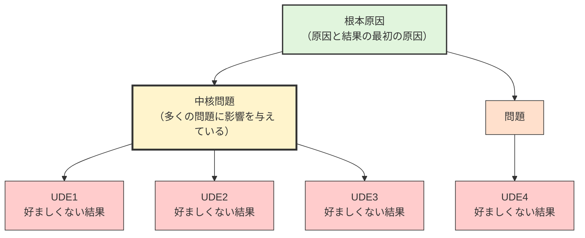

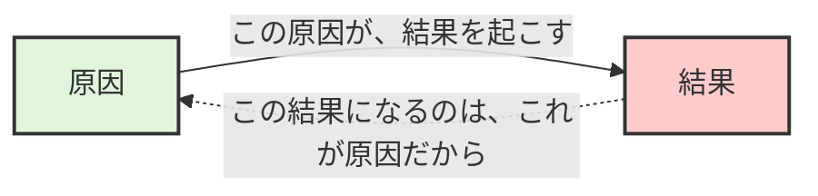

- 原因→結果：〜だから〜になる
- 原因←結果：〜になるのは〜だから
- UDE（好ましくない結果）：中核問題によって起こる事実
  - 否定的な表現
  - 誰が見ても好ましくない
  - 誰もが受け入れられない
  - スループットに悪影響がある
- 根本原因：原因と結果の最初の原因
- 中核問題：多くの問題に影響を与えている根本原因

※「なぜ」の掘り下げは最小限にとどめ、解消すべき中核問題を探す

### 提案フロー
1. 背景と目的：提案のきっかけ、今までの取り組み、目指す状態
   - 背景
   - 取り組み
   - 目的
2. 現状分析：現在の長所、現在の問題点
   - 長所
   - 問題点
3. ゴールとノットゴール：成功の基準、避けたい状態
   - ゴール
   - ノットゴール
4. 提案対象とニーズ：提案する対象、その人たちのニーズや懸念点
   - 〜さん
   - 〜グループ
5. リソースとリスク：人・時間・金銭的な資源の調整、提案に伴うリスク、リスクへの対策・対応方法
   - リソース
   - リスク
6. 課題と施策：解決すべき課題、採用する方法
   - 課題1
   - 課題2
7. 計画：誰が・いつ・何をするか
   - 〜さん、〜までに、〜をする
   - 〜さん、〜までに、〜をする
8. 評価と調整：評価する人・タイミング・方法、具体的な評価基準やKPI

### 意思決定フロー
1. 背景：どんな出来事に対して、何を感じて、何を問題点と考えて、どうしたいと考えたのか
2. 不明点：どんなことがわかっていないのか
3. ゴール：誰がどんな状態になるといいのか
4. ノットゴール：したくない状態、意図していないゴール
5. 賛成度合い：現時点で賛成寄りか反対寄りか、どれくらいの懸念点や不明点があるかを挙手
6. 認識合わせ：反対寄り人から懸念点を説明してもらい、賛成寄りの人と対話する
   1. 反対：全体的に賛成できない
   2. やや反対：問題が解決できないと賛成できない
   3. どちらでもない：どちらとも言えない
   4. ほぼ賛成：改善余地はあるが基本的に同意している
   5. 賛成：全面的に同意している
7. 決定：やるやらない、どうすれば決められそうか、いつ誰が何をするのか

### 問題解決の6階層
1. 状況：実際に「いつ」「どこで」「どのような出来事が」起こりましたか？
2. 問題：困っているのは具体的に「何が」「どのように」なってしまうからですか？
3. 期待：「何が」「どのような」状態になれば解決したと言えそうですか？
4. 原因：「何を」「どのような」状況にすると問題を再現できそうですか？
5. 対策：現実的かにかかわらず「どのような」解決策がありそうですか？
6. 評価：望んだ結果にするために「どの」対策が有効そうですか？

[「問題解決の6階層」で話し合いのプロセスを明確にする](https://zenn.dev/manabuyasuda/articles/06a369e211c353)

---

1. 状況：実際に「いつ」「どこで」「どのような出来事が」起こりましたか？
   - 実際にどんな出来事が起こりましたか？
   - どのような時系列でしたか？
   - 誰が何をしていましたか？
   - 数字やデータなどの客観的に確認できるものはありますか？
   - それらを知っている・確認できる人はいますか？
2. 問題：困っているのは具体的に「何が」「どのように」なってしまうからですか？
   - 困っているのは誰ですか？
   - どのようなことに不安を感じますか？
   - どんなことが滞ってしまったり、できなくなるのですか？
   - どのような指標に影響がありますか？
   - それが続くと、どのような結果が起きてしまいそうですか？
   - それが問題だと判断する客観的な情報はありますか？
3. 期待：「何が」「どのような」状態になれば解決したと言えそうですか？
   - 誰にどのような行動を起こしてほしいですか？
   - 誰にどのような気持ちになってほしいですか？
   - どの指標をどのように変化させたいですか？
4. 原因：「何を」「どのような」状況にすると問題を再現できそうですか？
   - 問題はいつも起きますか？問題が起きないこともありますか？
   - すべてがうまくいきませんか？継続するとよさそうなことはありますか？
   - 問題が起きるのは、どのタイミングで何をしたときですか？
   - 誰がやっても同じ結果になりそうですか？うまくできそうな人は何が違うと思いますか？
   - 「難易度を上げてしまっている状況や制約はありませんか？」
5. 対策：現実的かにかかわらず「どのような」解決策がありそうですか？
   - 何となくイメージしているものはありますか？
   - 実現性は置いておいて、思いついたアイデアはありますか？
   - 当たり前かもしれないけれど、まだ場に出ていないアイデアはありますか？
   - 出ているアイデアの良いところを具体的に教えてください
   - 出ているアイデアにあえて付け足せるものはありますか？
   - うまく表現できていないものがあれば、整理できていなくていいので教えてください
6. 評価：望んだ結果にするために「どの」対策が有効そうですか？
   - 期待値に直結しなさそうな、優先順位の低い対策はありますか？
   - 難易度が高そうだけど、いちばん効果が高そうな対策はありますか？
   - 直感的にどの対策がいちばん費用対効果が高そうですか？
   - 効果的ですぐに取り組めそうな対策はありますか？
   - 具体的なタスクに落とし込めていない解像度の低い対策はありますか？
   - これが現実的な方法だなと思える対策はありますか？
   - 対策に対して『条件なしで賛成』『条件付きで賛成』『条件付きで反対』『条件なしで反対』のいずれかで投票してください
   - 実施する対策はどのように進めていきますか？

### 空・雨・傘
1. タイトル：＜対象＞について相談したい
2. 空（事実）：いつ・どこで・何が起こった？
3. 雨（解釈）：どのようなトラブルに繋がりそう？
4. 傘（結論）：どのように対応すると問題を避けたり軽減できそう？
5. 紙（計画）：誰が・いつ・何をする？

---

- Theme（要約）：目的、まとめ
- Fact：現状認識
- Point：要点
- Action：やるべきこと

### 報告するときに意識すること
- 相手が想像できる具体的な方法を提示する
- そもそもの背景や目的を提示する
- 実施する場合の成果を提示する
- 参考情報や信頼性を提示する
  - 一般的や普通を理由にする場合はとくに
  - 試算結果の計算式や値を提示できるようにする

相手に疑念を抱かせるリスクを取り除いておく。  
そのために「あの人がこの報告を聞いたらどう思うかな？」と想像して、事前に準備をしておく。

### SMART
- 具体性（Specific）：具体的か、明確か
- 測定可能性（Measurable）：測定できる定量的な指標か
- 正確性（Accurate）：目的と整合しているか
- 現実性と実体性（Realistic and Tangible）：達成可能か、現実的か
- 有期性（Time bound）：期日が定められているか

### ECRS（改善の4原則）
1. 排除（Eliminate）：やらなくても問題が起きないものはないか？それをなくすことはできそうか？
2. 結合（Combine）：同じ成果物を複数人や複数の工程で作成していないか？それを1つにまとめて効率を上げられないか？
3. 交換（Rearrange）：今の進め方で時間をロスしていることはないか？効率のいい組み合わせはないか？
4. 簡素化（Simplify）：複雑でミスが起こりやすいことはないか？自動化や標準化などで単純にできないか？

[改善提案のプロセスと改善の4原則（ECRS）](https://zenn.dev/manabuyasuda/articles/504ebf755cc9df)

### ふりかえり

#### KPT
1. よかったこと（Keep）
2. 悪かったこと（Problem）
3. 次に試すこと（Try）

#### KPTA（ケプタ）

**Keep起因の循環（継続的改善）**

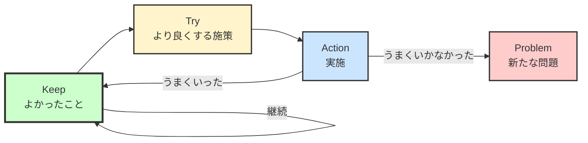

**Problem起因の循環（問題解決）**

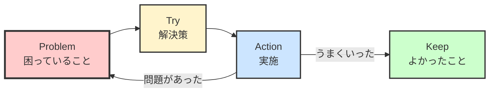

1. Keep：続けること（増やしていく）
2. Problem：問題点（顕在化する）
3. Try：試したいこと（質より量）
4. Action：行動すること（有効な施策を確実に実行する）

---

- 初回はProblemから、2回目以降はKeepから始める。
- Actionの効果がよければKeepに移行する。
- 個人ではなくチーム向きの思考法

#### YWT
1. やったこと（Y）
2. わかったこと（W）
3. 次にやること（T）

## コミュニケーション

### アサーティブ・コミュニケーション
#### アサーティブとは
自分の気持ちや意見を率直に表現しながら、相手の気持ちや意見にも率直に耳を傾ける言動のこと。  
お互いの意見を出し合い、それが食い違っていても、粘り強く共通点を見つける努力をすること。

#### アサーション権とは
私たちは
- 誰しもアサーション権を持っている
- 誰からも尊重され、大切にしてもらう権利がある
- 自分の行動を決める権利がある
- 誰でも過ちを犯し、それに責任を持つ権利がある
- 支払いにあったものを得る権利がある
- 自己主張しない権利もある

（代表的なものだけ抜粋）

### 話し合いのグランドルール
1. 「あいづち」「姿勢」「感想」などで、しっかりと話を聞いていることを示そう
2. 「失敗」や「問題」を歓迎しよう
3. 「誰かの責任」ではなく、「私たちで」問題を解決しよう
4. 「相手の意見」をしっかりと聞いて、「否定せずに」受け入れよう
5. 「どれくらい賛成しているか」から伝えて、「安心感」と「話を進める材料」を渡そう
6. 「違和感」や「疑問」をもったらすぐに伝えよう
7. 「自分にとっての当たり前」も、みんなに共有しよう
8. ひとりで話しすぎず、ときには「質問」してみよう
9. 「現状を棚上げ」して改善していこう
10. 「自分が今できること」から考えよう

[前向きに話し合いをするためのグランドルール](https://zenn.dev/tam_tam/articles/af5a2630e1f204)

### 質問に対する回答
1. 結論（相手が知りたいこと）から話す
2. 全体像を示してから具体を話す
3. 重要なことから1つずつ話して解決する
4. 相手にも話をふる

### 心理的安全性
[心理的安全性のつくりかた - JMAM 日本能率協会マネジメントセンター 「人・組織・経営の変化」を支援するJMAMの書籍](https://pub.jmam.co.jp/book/b517388.html)

#### 対人関係のリスク
1. 無知：だと思われたくない → 必要なことでも質問せず、相談をしない
2. 無能：だと思われたくない → ミスを隠したり、自分の考えを言わない
3. 邪魔：だと思われたくない → 必要でも助けを求めず、不十分でも妥協する
4. 否定的：だと思われたくない → 立場を考えて議論せず、率直に意見を言わない

#### 「学習する職場」の努力の源泉
1. サポート：成果が出ていなくても、罰や不安を与えず、相談に乗ってくれたりアイデアをくれたりする
2. 意義：組織・チーム・プロジェクトとして、大義や意味のある目標設定がされていて、やりがいや成長を実感できる
3. みかえり：成果に至らなくても、望ましい努力に対する承認や感謝を伝えてもらえたり、より適切な行動を促してもらえたりする
4. 配置：適材適所に配置されることで、自発的・自律的に努力できる

#### 3つのコンフリクト
1. 人間関係のコンフリクト：人の好き嫌い
2. タスクのコンフリクト：問題に対する意見の相違
3. プロセスのコンフリクト：誰が対応するかの相違

#### 日本における心理的安全性の4因子
1. 話しやすさ：「何を言っても大丈夫」
2. 助け合い：「困ったときはお互い様」
3. 挑戦：「とりあえずやってみよう」
4. 新奇歓迎：「自分の強みも弱みも受け入れてくれている」

#### 役に立つ行動に分解する
人の気持ちを動かすことは困難です。  
「自信を持って」と言っても効果はありませんが、「大きな声を意識してみて」とアドバイスすれば具体的な行動に結びつきます。

#### 「状況・文脈」
優秀なプレイヤーがマネージャーになったときに、同じ行動をとっていてはマネージャー失格です。
プレイヤーは自分が評価対象ですが、マネージャーは他人が評価対象だからです。

#### 「きっかけ→行動→みかえり」フレームワーク

**好循環（良いみかえり→行動が促進される）**

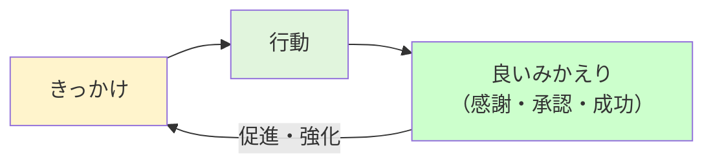

**悪循環（悪いみかえり→行動が抑制される）**

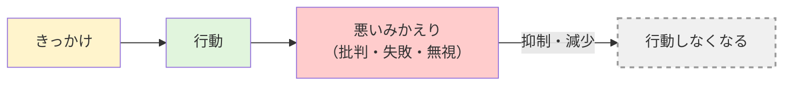

1. 行動は「行動しようと思えるきっかけ」で始まる。
2. 良いみかえりがあると、行動が促進される。悪いみかえりがあると、行動が抑制される。

---

1. 話しやすさ：「話しやすい雰囲気」→「話してくれたことに対する感謝」→「何を言っても大丈夫」
2. 助け合い：「助けてあげたい」→「感謝してくれた、別のことで助けてくれた」→「困ったときはお互い様」
3. 挑戦：「興味、鼓舞、促進」→「うまくいった、挑戦自体を認めてもらえた」→「とりあえずやってみよう」
4. 新奇歓迎：「特性や新しい視点が歓迎されている」→「同じように歓迎された」→「自分の強みも弱みも受け入れてくれている」

### 指示
- コンテンツ：知覚可能な情報
- コンテキスト：コンテンツを解釈する状況や背景
- ハイコンテキスト：解釈の幅が広い（受ける側に依存する）
- ローコンテキスト：誰でも同じように解釈できる（伝える側に依存する）
- 実例：言葉の定義ではなく、参照情報を伝える
- 定量情報：指標や単位
- 事実：固有名詞、日付と場所
- 動作：やってみせる
- 帰納法：当てはまる対象を狭める「つまり〜ですね」
- 演繹法：複数の根拠から新しい仮説を作る「A=BでB=Cだから、A=Cだ」
- 時系列：解釈がズレたタイミングを時間軸で探す

#### 指示の種類
- 調整：過不足をなくし、整えること。
- 修正：間違いではないが、不十分な箇所を直すこと。
- 訂正：（おもに言葉や文章の）間違いを正すこと。
- 更新：最新の状態に上書きすること。
- 変更：決定事項を変えること。

### ミス

#### ミスの種類
- 認知（見逃し、勘違い）：明快にする
- 記憶（曖昧、失念）：記憶に頼らない
- 判断（思い込み、考え違い、情報不足）：直観と熟考
- 行動（気がつかない、判断できない）：明確な判断基準

#### ミスの3H
- はじめて（品質不足、スケジュールの超過）：事前の準備、余裕のあるスケジュール、レビュー体制
- 変更（手順の変更、方法の変更）：事前の確認、マニュアル化
- ひさしぶり：変更内容の確認、余裕のあるスケジュール、マニュアル化

### クイックコール
- 「〜を相談したいので、クイックコールしてもいいですか？」  
- 「command + shift + I」でSlackのチャンネル詳細を開き、「通話を開始」

### ザッソウ：対面で有効なこと
- 雑談：とくにテーマのない気楽な会話、方向性が明確に定まっていない段階で意見を交換し合うこと、気軽に話しかけられるマインドと関係性が大切
- 相談：モノゴトを決定するために意見を求めたり話し合うこと、気軽に声をかけられるような日常的な人間関係の構築が大切

---

- 「報告」と「連絡」は非同期コミュニケーションで効率化できる。  
- 「相談」は対面で効率や効果が高くなる。  
- 「雑談」は円滑な関係性を築き、創造的なアイデアを生む土壌を作る。

### ホウレンソウ：コミュニケーションの基本
- 報告：依頼を受けた人が、具体的な進捗や結果を依頼者に知らせること
- 連絡：何らかの変化が起きたときに、客観的な事実を関係者に共有すること
- 相談：判断や決定をするために、意見を求めたり話し合うこと

### おひたし：ホウレンソウをしやすい関係性を築く
- 怒らない：相手を責めず、状況や問題に対して一緒に向き合う
- 否定しない：相手の気持ちや考えを尊重して、どう変えていくかに焦点を当てる
- 助ける：困っていることがないか確認して、課題を明確にする
- 指示する：必要に応じて、具体的な手順や段取りを教える

### こまつな：悩み続けずに行動する
- 困ったら：進捗が作れていない、決断できない、まったくわからない
- 使える人に：詳しい人、頼りになる人、相談しやすい人
- 投げる：相談する、一緒にやってもらう、お願いする

### ちんげんさい：やってはいけないこと
- 沈黙してしまう：自分を理解してもらうための情報を相手が受け取れなくなる
- 限界までやる：無茶をして身体を壊してしまうと自分も周りも苦しくなる
- 最後まで言わない：期限が近づくごとに挽回が難しくなる

### きくな：頑張り過ぎない
- 気にせず休む：
- 苦しいときは言う：
- なるべく無理をしない：

### かつおぶし
- 完璧を求めない
- つまらないことは気にしない
- 大きな心で
- 不恰好でいい
- 死ぬ気があればなんでもできる

### コーチング
[新コーチングが人を活かす | ディスカヴァー・トゥエンティワン - Discover 21](https://d21.co.jp/book/detail/978-4-7993-2610-7)

- 雑談でほぐす
- 答えやすい小さな質問からはじめる
- 受容→受容を伝える→質問で促す
- 自分の気持ちを正直に話す
- 評価ではなく、自分が感じた・考えたことで褒める（アクノレッジメント）
- 問いに対して一緒に考える（引き出そうとしない、提案を先に考えない）
- 「なぜ」ではなく「なに」を使う（攻撃的にならず、客観的になる）
- 抽象的な答えをチャンクダウン（具体的に）する
- チャンクアップ（抽象化）で、状態と行動をラベリングする
- 考える時間だと伝えて沈黙する
- 不満を提案に転化する
- 相手に関する質問を考えることで、相手の立場から考える
- 「もし、（条件）だったら？」の極端な質問で視点を変える
- イヤなことを話して材料を集める
- 過去の出来事から材料を集める
- ゴール達成時の状態を想像する
- 今の状態を採点する「たとえば、今の状態は100点満点中何点ですか？」
- 一般論はストーリーでプロセスを伝える
- 枕詞で緩和する「ちょっと言いにくいけど」「これは私の考えだけど」「考え違いかもしれませんが」

### 質問

#### 相づち（理解を示す、話を促す）
1. 共感を示す（反応）：「へ〜」「なるほど」「そうなんですね」
2. 話を促す（質問）：「それで？」「どうなったんですか？」
3. 話を繰り返す（復唱）：「〜なんですね」「〜と思っているんですね」
4. 話をまとめる（要約）：「つまり〜」「たとえば〜」

#### 質問の内容・対象（質問の順番）
1. 事実・経験：何がありましたか？どんなことをご存知ですか？
2. 知覚・感情：どのように感じましたか？どんな気持ちでしたか？
3. 思考・考察：どのように考えますか？なぜそうなるのでしょうか？
4. 価値・信条：何が大切ですか？何をすべきでしょうか？
5. 決定・行動：これから何をやりますか？どうしたいですか？

#### 5W1H
1. 誰が（Who）：人・組織
2. いつ（When）：時間・機会・頻度
3. 何を（What）：行動・成果物・施策
4. なぜ（Why）：理由・目的
5. どうやって（How）：方法・程度
6. どこで（Where）：場所・場面

#### 視点（主語や前提を提示する）
1. 人：「あなたは」「〜の立場では」
2. 時間：「明日からできることは」「〜年後までには」
3. 空間：「チームとして」「〜業界として」
4. 目的：「〜を達成するためには」「〜な状態にするには」

#### オープン・クローズド（話の幅を調整する）
- オープンクエスチョン：自由に回答できる、コントロールされない、話を広げたり深められる、アバウトだと答えにくい
- クローズドクエスチョン：イエスかノーまたは定量的に回答できる、話を絞り込める、やりすぎると誘導と感じやすい

#### 拡大・収束（話を構造化する）
1. 拡大：「たとえば」→具体化する、「他には」→具体例を集める
2. 収束：「つまり」→具体例を整理する、「なかでもどれが」→焦点を絞る、「だとすると」→一致と不一致を確認する

#### 否定的・肯定的（ポジティブに方向づける）
- 否定的（Why、Who）：なぜ失敗したのですか？誰がまずかったですか？
- 肯定的（What、How）：何を変えますか？どうやったら成功しそうですか？

#### 仮定・強制（気づきを引き出す）
- 仮定質問：もし〜ができるとしたら何をしますか？
- 強制質問：あえてやれることがあるとしたらなんですか？

#### リレー（安心感を与える、意見を補強する）
- リレー質問：今の意見をどう思いましたか？同じ意見の方はいますか？あえて付け加えるなら何かありますか？

### 意見を引き出す手法
1. 手あげアンケート：選択型の質問を挙手で意思表示して、議論の口火を切る
2. バズ：2〜3人で集まって、テーマに関して思ったことを雑談する
3. ペアインタビュー：2人でお互いの思いや考えを取材しあって、理解を深めていく
4. ブレーンストーミング：4つのルール（自由奔放、批判厳禁、便乗歓迎、質より量）を守りながら、自由にアイデアを連想していく
5. ストラクチャードラウンド：順番に発言を回し、他の人は傾聴に徹する
6. ダイアローグ：テーマの本質に関わる新たな考え方を探求する話し合い
7. ワールドカフェ：小グループに分かれて、メンバーを交代しながら対話を重ねていく
8. ディベート：賛成派と反対派に分かれて、自説を主張し、相手に反論をする
9. 親和図法：意見を付箋に書き出して、似たような意見をグループ化していく

### フィードバック
- フィードバックは双方向の共同作業
- 受け止めてもらえる安心感があるからフィードバックできる
- 褒め5：指摘1のバランスにする
- 伝え手：成長を願う気持ちを持つ、伝える技術を身につける
- 受け手：受け止める心構え、成長意欲を大切にする、自分の可能性を信じる→コーチャブル

#### コーチャブル
- 成長意欲が高く、受け止める謙虚さがあり、行動に移せること
- コーチャブルな人は着実に成長し、チャンスが舞い込んでくる
- 非コーチャブルな人は現状維持を好み、自分の殻に閉じこもり、何を言ってもダメだと思われる
- 伝え手は躊躇しながらも伝えてくれてくれていることを意識する
- 頑固にならず謙虚に、恐れず信頼する
- 心構え：役に立つかで判断する、課題は成長余地、ポジティブに受け入れる、自分のことは棚にあげる
- 傾聴：耳が痛くても最後まで聞く、反応的にならない、行動を振り返る機会と捉える
- 受容：感謝を伝える、理解に齟齬がないか確認する、やり方は自分で決める、すべてを変えなくてもいい

### ポジティブフィードバックのコツ
- 行動を具体的に：どんな行動が、どのように良かったのか
- 早めに：その場で、さっきのことを
- 最適な場所：みんなの前で
- 絶対的な評価で：人と比べない
- 心から褒める：本心は見抜かれる
- 表現を増やす：褒め言葉をストックする
- 褒め返す：褒めてくれたら謙遜せず「ありがとう、あなたも」と褒め返す

### ギャップフィードバック
- 不足に対するギャップと、理想に対するギャップを意識する
- 小さな気づきを日常的にフィードバックする
- 大きな改善要求は、しっかりと準備して伝える
- プライドを傷つけないように1対1で伝える
- テキストではなく口頭で、ポジティブに受け止めてもらえるように工夫する

### ギャップフィードバックの6つRight
1. Right Occasion：ポジティブな受け入れやすいタイミングで
2. Right Place：他人のいる場所を避けて
3. Right Tone：叱責せず、暖かく敬意を持って
4. Right Atmosphere：感謝5対ギャップ1の頻度で
5. Right Relationship：普段から信頼しあえる関係を
6. Right Motivation：相手の成長を心から願って

### ギャップフィードバックのソラ・アメ・カサ
1. ソラ（事実・事象→認識合わせ）：
   - ラポールビルディング：話しやすい雰囲気
   - 事実確認：事実をベースに、具体的に、偏った主観や感情を排して
2. アメ（課題特定→ギャップの合意）：
   - あるべき姿：理想と不足の合意
   - 課題提起：人ではなく課題にフォーカス、決めつけない、指摘は1つに絞る
   - 傾聴：じっくり話を聞く、共感を示す、主題以外はあえて聞き流す
3. カサ（改善案→アクションの合意）：
   - 内省を促す：改善案は自分で考えてもらう、辛抱強く待つ、傾聴する
   - 助言：求められるのを待つ、必要か確認する

### 質問の5階層
1. 事実・経験：「何が起こりましたか？」「どんなことを知っていますか？」
2. 知覚・感情：「どのように感じましたか？」「どのような気持ちになりましたか？」
3. 思考・考察：「どのように考えましたか？」「なぜそうなると思いますか？」
4. 価値・信条：「何を大切にしたいですか？」「何をすべきだと思いますか？」
5. 決定・行動：「これから何をやりますか？」「どうしていきたいですか？」

### 質問のもらい方
1. ゴール：疑問を解決して「決めたいこと」「実現したいこと」はなんですか？
2. 問題：具体的にどんなところに「困って」いますか？
3. 情報：問題点がわかる画像やリンクなどの「参考情報」があれば教えてください
4. 現状：「知っていること」「調べていること」があれば教えてください
5. 施策：こうするとよさそうな「仮説」はありますか？
6. 課題：どんな情報があれば疑問は「解消」できそうですか？

### 黙っている人の5分類
1. 議論についていけない
2. モヤモヤして考えがまとまっていない
3. 言いたいけれど遠慮している
4. 他の人と同じ意見なので黙っている
5. 議論に興味がない

### 「質問ありますか？」への返答
1. 問題なく実施できそう
2. やってみたら質問あるかも
3. 質問したいけど考えがまとまっていない

### 認知の歪み
1. ゼロイチ思考：二分法で捉えて、グラデーションを認識できていないこと
2. 極端な一般化：少ない根拠から、主語の大きい結論で決めつけること
3. すべき思考：「〜すべき（Should）」と期待・強制をして、できなければ罰してしまうこと
4. 心のフィルター（選択的注目）：思い込むと、それを証明するような情報しか目に入らなくなること
5. レッテル貼り：「〜だからだ」と、その人の特定の属性だけを原因と捉えてしまうこと
6. 結論の飛躍：相手の何気ない行動を、確認もせずネガティブに受け取ってしまうこと
7. 感情の理由づけ：「不安だから失敗しそう」「嫌いだから価値がない」のように、感情のみを根拠に判断すること
8. 認知的不協和：自覚している悪いこと（矛盾）を正当化するために、整合性のない情報を取り入れること

### 4つのイドラ
1. 種族のイドラ：身体的な性質から起こる錯覚や偏見
2. 洞窟のイドラ：自分の環境が一般的だと決めつけたことによって起こる偏見
3. 市場のイドラ：周りの言葉から、ありえないことを信じてしまう誤解や偏見
4. 劇場のイドラ：伝統や権威を重んじて、無批判に正しいと受けられる偏見

### テキストコミュニケーションのコツ
1. 探させない
2. 思い出させない
3. 見比べさせない
4. 推測させない

- 全体像を伝える
- やったことを伝える
- やってほしいことを伝える
- 必要な情報だけをその場で伝える

## プロジェクトマネジメント

### 品質（狩野モデル）
- 当たり前品質：あって当然・ないと不満
- 一元的品質：あると嬉しい・ないと不満
- 魅力的品質：なくてもいいけど・あると嬉しい
- 無関心品質：あってもなくても影響がない
- 逆品質：あると不満・ないと嬉しい

[狩野モデルから探る品質のあり方とは - SHIFT ASIA -オフショア開発・ソフトウェア開発およびソフトウェアテスト・品質保証のプロフェッショナル-](https://shiftasia.com/ja/column/%E7%8B%A9%E9%87%8E%E3%83%A2%E3%83%87%E3%83%AB%E3%81%8B%E3%82%89%E6%8E%A2%E3%82%8B%E5%93%81%E8%B3%AA/)

### Why This, Why You, Why Now, Why Me/Us
- Why This（価値）：なぜこれをやるのか？どんな課題を解消できるのか？
- Why You（課題）：なぜあなたに提案しているのか？どんな成果を生み出せるのか？
- Why Now（優先度）：なぜ今やるべきなのか？やらないとどんな損失があるのか？
- Why Me/Us（実現性）：なぜわたしを選ぶべきなのか？なぜわたしたちならできるのか？

### 優先度
- 重要度：欠けた場合に困る度合い
- 緊急度：遅れることによって損失が起きる可能性・損失の度合い
- 不確実度：未知の度合い、予定通りに実現できる可能性
- 必要：ないと困る（不可欠である）こと
- 願望：なくても困らないけどあるとよいもの
- 生産性：成果（効果・品質）÷投資（お金・時間）

### リスク

**リスクの大きさとマトリクス**

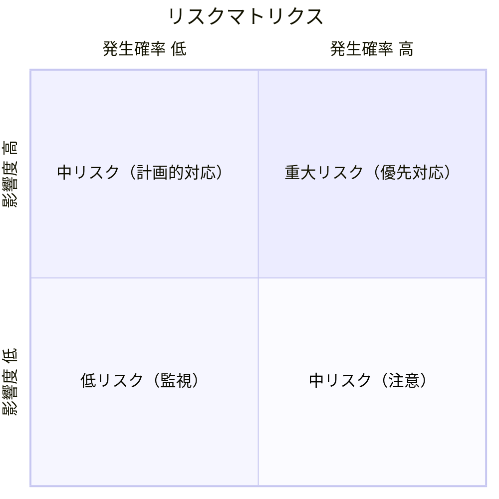

**リスクマネジメントプロセス**

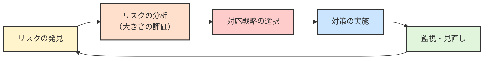

**対応戦略（脅威に対する戦略）**

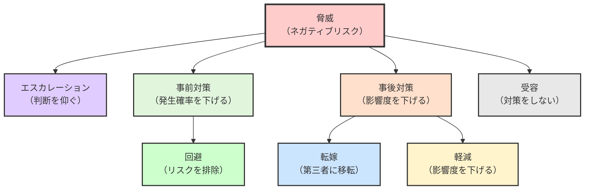

**対応戦略（好機に対する戦略）**

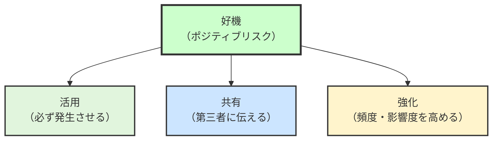

- リスク = 脅威（敵対的な意図×能力）・資産（守るべき対象）・脆弱性（技術的、管理、人の行動）
- リスクの大きさ = 発生確率×影響度
- リスク発生源 = 内部リスク（顕在的・潜在的）＋外部リスク（顕在的・潜在的）
- リスクマネジメントプロセス：リスクの発見→対応→監視
- 対策 = 事前対策（発生確率を下げる）＋事後対策（影響度を下げる）
- 対応戦略
  1. 報告：「原因がプロジェクト外」または「プロジェクトマネージャーの権限を超えている」場合は「スポンサーに」判断を仰ぐ（エスカレーションのこと）
  2. 回避：「確立された方法や市場」「現実的な期日と成果物」などに見直して特定したリスクを「プロジェクトから」完全に排除する
  3. 転嫁：「保険」「契約」「アウトソーシング」などでリスクの責任や影響を「第三者に」移転する
  4. 軽減：「リスクが発生する原因の除去」「リスクが発生しても問題が起きない対策」を受容できるレベルまで減少させることでプロジェクトにおける「リスクの影響度合い」を下げる
  5. 受容：「バッファー」「事前対応をしない」などでリスク対応にかかる「リソースを最小限に」抑える
  6. 活用：好機が必ず発生するようにする
  7. 共有：好機が発生した場合にその好機を活かせる第三者に伝える
  8. 強化：好機の発生頻度や影響度を高める

### QCD
- 品質（Quality）：要望・要件を満たすこと
- コスト（Cost）：予算内で作成すること
- 納期（Delivery）：期限内に納品すること

### トレードオフスライダー

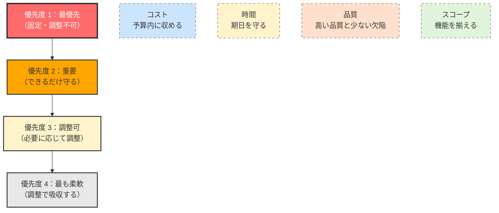

4つの要素のどれを優先するかを決める：
- コスト：予算内に収める
- 時間：期日を守る
- 品質：高い品質と少ない欠陥
- スコープ：機能を揃える

### 要件定義
1. 要望：「こうなるといいな」→「なぜ」それを求めているのか、現状ではどうなのか
2. 要求：「こういうことを実現したいです」→「どんな」ことを実現したいのか、実現可能か、効果的か
3. 要件：「この条件で進めていきましょう」要求・検討・提案を繰り返して合意する→「前提条件」は何か、「どのように」実現するのか、何をもって完了とするのか
4. 仕様：整合性を保って要件を実現するための取り決め（要件定義で実現性を担保する）
5. 設計：仕様を具体化する工程

---

- 画面設計：「画面ごとの役割」「表示する情報とレイアウト」「画面遷移」
- 機能要件：「機能名」「処理内容」「必要なデータ（取得元）」「操作方法」
- 非機能要件：性能（パフォーマンス、容量）、運用・保守（バックアップ）、移行（移行方法）、セキュリティ（利用制限、不正アクセス防止）
- データ設計：入力（ユーザー→画面、データベース→機能）、出力（画面、データベース）

### アクティビティリスト
- ID：
- ステータス：待機中、処理可能、処理中、処理済み、完了
- アクティビティタイトル：<名詞>を<動詞>する
- インプット（必要な情報・リソース）：
- アウトプット（成果物・完了状態）：
- 完了期限：
- 工数（人日）：
- 予算（円／時）：
- 担当者：

### 課題追加（Backlog）
1. タイトル：（<名詞>の）<名詞>を<動詞>（必須）
2. カテゴリー・種別（必須）：「誰が」「何を」（カテゴリー）、具体的な「行動」「状況」（種別）
2. 経緯（必須）：「なぜ」課題を追加したのか
3. 発生状況：「どんな」状況で問題が発生するのか
4. 完了条件（必須）：「何を」解決すれば完了できるのか
5. 素材・データ・URL：完了するために「必要な情報」はあるか
6. トレードオフスライダー（任意）：「すべての」機能が必要か（スコープ）、「予算内に」収めたいか（予算）、「期日内に」完了したいか（時間）、「品質を高く」・欠陥を少なくしたいか（品質）
7. 懸念点：「障害」になりそうなことはあるか
8. 案件No.や予算：「課題登録」されているか、「どれくらい」の予算で完了させる見込みか
9. 優先度：高： 緊急対応など他の課題より優先しなければならないタスク。中： 期日中に終わらせればいい課題。低い：時間に余裕があり、期限日を目安に完了できればいい課題。期限日はリスケをして再設定することができる。

### 課題追加（Asana）
1. タイトル：（<名詞>の）<名詞>を<動詞>
2. 担当者：「誰」が責任者か（サブタスクの責任者もかねる）
3. 説明：
   -  【経緯】：「なぜ」課題を追加したのか
   - 【発生状況】「どんな」状況で問題が発生するのか（省略可）
   - 【完了条件】「何を」解決すれば完了できるのか
   - 【情報】完了するために「必要な情報」はあるか
   - 【懸念点】「障害」になりそうなことはあるか（省略可）
4. 期日：「いつまで」に完了するか
5. 優先順位（PR）：できるだけ早く > 期日中 > リスケ可能
6. 依存関係（DPD）：完了を待つ別課題はあるか
7. 見積もり時間（EH）：順調にいけば何時間くらいで完了するか（タイトルに`[10]`のように指定してもいい）（省略可）
8. 実績時間（AH）：完了までに何時間かかったか（省略可）

### 見積もり
- 超概算見積もり（-50%〜+100%）：要求ベースの大まかな見積もり
- 概算見積もり（-25%〜+50%）：要件ベースの振れ幅のある見積もり
- 確定見積もり（-5%〜+10%）：仕様ベースのできる限り正確なもの
- 類推見積もり：過去の似たプロジェクトの実績から類推する
- 係数見積もり：「ファンクション・ポイント法」などで工数を類推する
- ボトムアップ見積もり：アクティビティ工数の積み上げで集計する

### タスクの優先順位を決める
1. 緊急度：早く対応しないと悪影響が起こる度合い
   - 金銭面やブランドの毀損など
   - 高：できるだけ早く解決したい、中：期限までに対応したい、小：期限を過ぎても問題がない
2. 重要度：最終的な成果につながりそうな度合い
   - 高：完了しないとマズイ、中：期限までに対応したい、小：やらなくても問題がない
3. 不確実性：やってみないとわからない状態か
   - やってみたいと判断もできないので、まずは着手してみて情報を手にいれる
   - 調査・計画フェーズがあると安全
4. コミュニケーションコスト：やりとりに時間がかかりやすいか
   - 誰かと認識合わせが必要か？どのような報告が必要か？
   - 相手は多忙か？やり取りする人数は多いか？定期的な接点をあらかじめ決めておくか？

上から考えていく。  
緊急度が高いものが2つあったら、その中の重要度が高いものから着手する。  
重要度が同じくらいなら、不確実度が高いものやコミュニケーションコストが高いものから着手する。

### ガントチャートで見通しをつける
1. ガントチャートを作る
   - テキストだけだと
      - 俯瞰して見られない
      - 「ここ厳しそう」に気付きにくい
      - 具体的に、いつ何をするのかをイメージしにくい
2. 期限を把握する
   - 厳守が必要な期日
   - 調整可能な期日
3. 必須と任意を決める
   - 絶対に必要なこと
   - やらなくてもいいこと
4. 外部要因を把握する
   - これがないと進められないものはあるか？
   - これが起こると困ってしまうことは何か？
5. ざっくりとしたスケジュール感を決める
   - いつごろ、何を作るか（成果物、中間成果物）
   - どのような順番か？依存関係の整合性は取れているか？
   - 現実的か？バッファーはあるか？
6. 先行して進めることを決める
   - 不確実性の高いことから着手
      - 検証できたらいいので、作りきれなくていい
7. 相手に依頼する
   - これがないと進められないですよ、遅れるとこうなりますよ
   - これをやってください、いつまでに
   - こういう懸念があるので、優先的に進めてください

### 制作ワークフロー

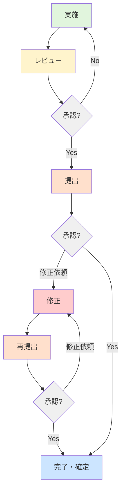

1. 実施（作成、実装、定義）
2. レビュー（確認、修正、承認）
3. 提出（確認、修正依頼、承認）
4. 修正
5. 提出（確認、修正依頼、承認）
5. 完了・確定

### テンプレートで量産する手順
1. ワイヤーフレームレベルで主要なページの要素を洗い出す（ページパターン×3くらい）
2. 主要なページからコンポーネントやレイアウトパターンを洗い出す
3. コンポーネントやレイアウトのルールを決める
4. パターンを使ってバラツキが出そうな3ページで展開、必要に応じて調整する
5. ページボリュームによって大中小に分類する
6. ページボリュームごとに3ページで展開、かかった時間を計測する
7. ここまでの作業者と量産担当者が違う場合は、6.をもう一度実施する
8. 残ったページ×かかった時間で全体の工数を計算、具体的なスケジュールに落とし込んで侵攻する

事前のルール決めや計測に時間をかけるほど確実性が増す。  
量産の展開時には反映だけでなく、確認・フィードバック・調整も計画を立てる。  
パターンとして共通化できる範囲と個別に対応する箇所を決めておく。

### ミーティングの目的
1. 決定する
2. 依頼する
3. 相談する
4. 収集する
5. 報告する

目的から完了条件を導き出して、そこに至るまでのプロセスを設計する。

### ミーティング
1. 目標・ゴール：「何を」決めたいか、「どんな」状態にしたいか
2. アジェンダ：「議題」と「話し合う時間」
3. 議題名：<名詞>を<動詞>する
4. 概要：「なぜ」話し合うことにしたのか
5. 進め方：誰が「進行」するか、どの話から「始める」か、誰が「決定する」か
6. 準備：「事前」に準備しておくこと
7. 内容：「意見」や「アイデア」
8. ネクストアクション：「誰が」「何を」「いつ」するのか
9. まとめ：次回以降に話し合いたいことは、次回の進行と議事録の担当は

### 実証実験
- PoC（Proof of Concept、概念実証）
  - 技術的に可能かどうかを確認
- PoV（Proof of Value、価値実証）
  - 技術導入で得られる価値（効果・効率・KPI改善）を確認
- PoB（Proof of Business、ビジネス実証）
  - ビジネスとして成り立つか（収益性・市場性）を確認

### Design Doc
[依頼内容が曖昧で情報が散らばっていたら→Design Docを書いて認識合わせをする](https://zenn.dev/manabuyasuda/articles/7045eebfcf87f5)

#### 存在意義
1. 明確化（Define）：新しいシステム、プロセス、または機能について、PM以外のメンバーが実装またはサポートするための作業ができるように、取り組みの詳細を明確化すること
2. 合意形成（Align）：なぜ、何をするのか、何を変えるのかについて、様々なステークホルダー間の合意形成を促進し、議論を円滑にすること
3. 記録（Record）：チームやステークホルダーが、いつ何をどう決めたのかを思い返すためのリファレンス

#### 合理的なコミュニケーション
- 個人：記憶は薄まる、人の気は変わる、1人の知識は完璧ではない
- 組織：個人・チームが持つ優先順位は違う、それぞれが異なる視点を持っている、口頭でのコミュニケーションは不完全

#### 基本構成
1. この取り組みのゴール（Goals）：このプロジェクトで何を達成しようとしているのか、この機能によってどのようなユーザー課題を解決しようとしているのか、定量的な「なぜ」を書き「何を」を書かない、スコープを肥大化させない
2. あえて含めないこと（Non-goals）：プロジェクトにあえて含めていないスコープ外のこと、フォローアップとして検討していること、現時点であえて受け入れるコストやリスク
3. 背景（Background）：ゴールを理解するための情報、この取り組みを実行すると決めた理由、意思決定を促したデータや情報、過去の経験、調査結果
4. ユーザーストーリー（User Stories）：この取り組みとアプローチに価値がある理由をユーザー視点で書く、この取り組みを届ける相手（ユーザー）の心境や動機、ユーザーの体験はどうあるべきか、なぜユーザーはこの取り組みに前向きに反応してくれるのか、何をもって良い悪いを判断するのか
5. 取り組みの成功を決める指標（Success Metrics）：何を測定するのか、どのように測定結果を判断するのか、どうなったら成功と言えるのか
6. もっとも検証したい仮説（Biggest hypotheses）：ゴールを達成するために実施する施策としてこの取り組みが妥当である理由
7. 取り組みが失敗する原因（Risk/Pre-mortem）：死亡前死因分析（プレモーテム）、リスクを事前に可視化・言語化する、リスクの対処方法
8. 機能要件（Functional Requirements）：何を構築するのか、何の疑問もなく手を動かし始められるレベルの詳細な要件定義
9. 検討した代替案（Alternatives Considered）：ゴールを満たすためのアプローチ候補、要件定義に含めなかった理由
10. 取り組みの結果レポート（Results）：取り組み完了時点の分析結果、定量分析・定性分析、結果の検討と仮説、このレポートが次のゴール・背景・ユーザーストーリー・最大の仮説になる

### スクラム
#### 役割
- プロダクトオーナー：プロダクトの成果に責任を持つ唯一の最終責任者で、プロダクトバックログの管理をしながら「何を優先して作るのか」を決めて、チームに伝えます
- スクラムマスター：スクラム活動がうまく回って、自己組織的なチームになることを支援します
- 開発者：「どのように作るのか」に責任を持つ、フラットに一丸となって働ける専門家集団で、スプリントバックログを管理します

#### スクラムイベントとツール
- インセプションデッキ：みんなでそのプロダクトのことを考えて、プロダクトのゴールや魅力、リスクやざっくりとした全体像などをスライドに書き出します
- プロダクトバックログ：そのプロダクトを形づくる効用（顧客が実現したいと思っていること）に優先順位をつけて一覧化します
- ユーザーストーリーマッピング：効用を「目的と理由」「時系列」「優先順位」などで整理して、作りやすい大きさに揃えます
- ストーリーポイント：基準を決めて小さく比較することで、いつまでにどれくらい完了できそうかを予測します
- スプリント：2週間などの短い期間でスクラムイベントを繰り返します
- スプリントプランニング：そのスプリントで「何を届けて」「どのように実現するか」を計画して、スプリントバックログに落とし込みます
- スプリントバックログ：スプリントのゴールを達成するために必要な作業の一覧です
- インクリメント：スプリント終了時の成果物で、リリースできる状態にしておきます
- デイリースクラム：チームで毎日開催して、スプリントゴール達成に向けての共有・カイゼン・意思決定をします
- スプリントレビュー：スクラムチームとステークホルダーがインクリメントを検証して、プロダクトをよくするために意見を交換します
- スプリントレトロスペクティブ：そのスプリントのプロセスから、継続すること・カイゼンしたいことについて話し合います

#### インセプションデッキ
1. 我々はなぜここにいるのか（Why）：プロジェクトを始める理由、顧客は誰、達成すべきゴール、3つの理由と1つの根幹的な理由
2. エレベーターピッチ（Why）：30秒以内にプロジェクトをアピールするなら？具体的には？本当にそうだと言える？「潜在的なニーズを満たしたり、課題を解決」したい、「対象顧客」向けの、「プロダクト名」というプロダクトは、「プロダクトのカテゴリー」です。これは「重要な利点、対価に見合う説得力のある理由」ができ、「競合や代替手段」とは違って、「差別化の決定的な特徴」が備わっている。
3. パッケージデザイン（Why）：広告を作るならどんな内容がよさそう？顧客のメリットは？キャッチコピーを作るとしたら？
4. やらないことリスト（Why）：プロダクト全体でやらないこと、フェーズごとのやらないこと、あとで決めること
5. 「ご近所さん」を探せ（Why）：広い範囲のプロジェクト関係者を把握する、協力してもらう人は誰か、協力してあげる人は誰か
6. 解決案を描く（How）：概要レベルの解決案を描く、認識があっていることを確認する
7. 夜も眠れなくなるような問題は何か？（How）：スコープ・予算・時間・品質に悪い影響が出そうな問題や心配事はあるか、自分だけが知っていそうなリスクはあるか、影響度はどのくらいか、プロジェクト内で起こるか外部で起こるか
8. 期間を見極める（How）：小さなゴールを決める、ゴールをマイルストーンに設定する
9. トレードオフスライダー（How）：スコープ・予算・時間・品質に順番をつける、スコープ（機能をすべて揃える）・予算（予算内に収める）・時間（期日を死守する）・品質（高い品質、少ない欠陥、品質とは何か）
10. 何がどれだけ必要か（How）：誰が何をするか、誰が何を決定するか、コストはどれだけ必要そうか

#### ユーザーストーリー
- アジャイル開発でプロダクトバックログ作りに使われる。
- 実現したい機能をユーザー目線で簡潔に洗い出す。  
- 「何を」「なぜ」「誰のために」作るのかを合意するために対話する。

以下のような形式にするとスムーズ。

- ユーザーの種類：投稿者は
- 目的：動画にタグ付けできる
- 理由：検索しやすくする

マッピング

1. 時間軸に沿って付箋を並べる（決めやすいところから）
2. 同じ内容はまとめるか1つを残す
3. 関連する付箋を集めて見出しを作る

見落としがないか？

- 今までの経験上で必要なものはある？
- 理想的な状況ではどんなことができるそう？
- 想定外の状況ではどんなことが起きそう？

「ユーザーストーリーマッピング」で俯瞰するので、洗い出し時点では詳細に考えなくてもいい。

リリース対象を絞る

1. リリース対象を決める（希望的なスケジュールや予算、ユーザーが達成したいこと・できればより嬉しいこと）
2. 優先度の軸に線を1つ引く
3. その対象内で必要なものを上に、それ以外を下に移動する
4. リリース対象を狭める（最低限のスケジュールや予算、最低限ユーザーが達成したいこと）
5. 優先度の軸のいちばん上に線を1つ引く
6. その対象内で必要なものを上に移動する

##### ユーザーストーリーのコツ（INVEST）
- Independent：独立している、スコープを入れ替えやすい
- Negotiable：交渉可能、融通が効く、調整の余地がある
- Valuable：価値がある
- Estimatable：見積りできる
- Small：小さい
- Testable：テスト可能、完了条件が明確

#### ユーザーストーリーマッピング
- 優先度：
   1. 必須
   2. 魅力的にするもの
   3. あると良いもの
   4. 将来的に検討するもの
- 時間軸（ユーザー体験の流れ）
- 分類
- ストーリー

#### ストーリーの初期見積もり
1. この初期見積もり方法の目的を説明する：大まかな数字を把握するため、ストーリーの理解度が上がったら数字を修正する機会があること
2. 項目をザッと確認する：1項目あたり最大90秒制限、カードの表にはタイトル・裏にはストーリーを書く、参考情報があればそれを見せる
3. （黙って）サイズ順に並べる：時間がかからないストーリーの順でカードを一列に並べる
4. （黙って）同じくらいの大きさの項目にわける：白紙のカードを横に7枚並べる、7つのグループ内が同じくらいの大きさになるようにする
5. グループごとにポイントをつける：白紙のカードにポイントを割り当てる（1・2・3・5など、またはチームが使っている規定値）

#### MVP
- Minimum Viable Product
   - 最小限の
   - 実現可能な、生存能力のある
   - プロダクト
- 最小のアウトプットで最大のアウトカムとインパクトを得る
- 小さく作ってフィードバックを得る

車をタイヤから作るのではなく、乗って進めるものから作る。

### サイトの種類
- コーポレートサイト：企業の会社紹介を中心としたウェブサイト
   - ターゲット：すべて（求職者、株主、社員、協力会社、地域住民、行政）
   - 目的：とくになし（情報提供）、顧客獲得（製品・サービス）、採用
- 製品サイト・サービスサイト：
   - ターゲット：顧客（見込み、既存）
   - 目的：顧客獲得（問い合わせ、お試し）、製品サポート情報（とくにBtoC）、売買・注文
- ブランドサイト：製品やサービスよりも、自社のストーリーを語るサイト
   - 目的：ブランドロイヤリティーの醸成、インナーブランディング、ブランド指数の向上
- 採用サイト：採用活動に特化したウェブサイト
   - ターゲット：新卒、中途
   - 目的：応募獲得、外部転職サイトなどとの連携
- IRサイト
   - ターゲット：個人投資家、機関投資家
   - 目的：経営状態や財務状況、業績、見通しなどの広報活動
- キャンペーンサイト：
   - ターゲット：商品やサービスの見込み顧客
   - 目的：顧客獲得（問い合わせ、お試し）
- ランディングページ：
   - ターゲット：顧客（見込み、既存）
   - 目的：製品サイトとは違ったセグメントへの訴求
- ECサイト：決済機能を搭載したウェブサイト（単独型、モール型）
   - ターゲット：顧客（見込み、既存）
   - 目的：サイト内での購買
- オウンドメディア：自社で情報発信をしているメディア全般（SNS公式アカウントなども含む）
   - ターゲット：顧客（見込み、既存）、同業他社
   - 目的：広範囲な認知向上、顧客獲得、応募獲得
- イントラネット：
   - ターゲット：社員
   - 目的：社内に向けての情報提供・社内システム
- ウェブアプリケーション：ブラウザベースのアプリケーション（GoogleスプレッドシートやDropboxなど）

### 100%ルール
要素分解はMECE（漏れなくダブりなく）にすること。

### 8/80ルール
作業の最小単位は、8時間（1日）以上、80時間（2週間）以内にすること。

### 7×7ルール
- 作業の分解は7つ以内に収めること。
- 階層の分解は7つ以内に収めること。

## KPIマネジメント
[『最高の結果を出すKPIマネジメント』](https://www.forestpub.co.jp/author/nakao_ryuichirou/lp/kpi/)

### KPIとは
- KPI：Key Performance Indicator（重要指標）
   - KP：事業成功の鍵
   - I：指標・数値目標

#### KGI→CSF→KPI
- KGI（Key Goal Indicator）：最終目標数値（売り上げや利益など）
- CSF（Critical Success Factor）：最重要プロセス（案件数や案件額など）
- KPI（Key Performance Indicator）：最重要プロセスの目標数値

#### KPIマネジメントのコツ
- KGI→CSF→KPIの順番で考える
- CSFとKPIは1つに絞る
   - 多すぎると、どれかを優先してやったふりをする
   - 未達の項目が多いと、効果測定が複雑になる
- 活動サイクルを増やす
   - ふりかえりの周期を決める

#### KPIマネジメントのプロセス
1. KGIの確認：利益○○円など。
2. ギャップの確認：現在とKGIのギャップは利益○○円など。
3. プロセスの確認
   1. モデル化（利益 = 売上 - 費用、売上 = アプローチ量 × 歩留まり × 価格など）する
   2. 項目ごとの対策を洗い出す
4. 絞り込み
   1. 項目を定数（変えられないこと）と変数（変えられること）にわける
   2. 変数の中から施策を洗い出す
   3. 施策から「できること」「効果の高いこと」を基準にCSFを1つ決定する
5. 目標設定：
   1. KGIを達成するための指標をCSFからモデル化する
   2. 項目の重要度の高いものからKPIを1つ決定する
6. 運用性の確認
   - 整合性
      - CSFの変化がKGIで観測できるか？
      - KGIの達成でCSFも達成するのか？
      - KPIを見ていれば異常や正常が判断できるか？
      - 事前検証が必要か？
   - 安定性
      - KPIのデータ入手や加工は安定的にできるか？
      - データ入手や加工を外部に依存していないか？
   - 単純性
      - KGI・CSF・KPIの関係性がわかりやすいか？
      - 関係者が腑に落ちた状態で実行してもらえるか？
7. 対策の事前検討
   - KPI悪化時の対策
      1. いつ：○ヶ月経過後、○週間ごと、その都度
      2. どれくらい：どの程度悪くなったら
      3. どうするのか：資金や人の投入、変えない
      4. 最終判断者：決裁者
8. コンセンサス：関係者との合意
9. 運用：
10. 継続的な改善：

### KPI・KGI一覧
[KPI・KGI一覧](https://paper.dropbox.com/doc/KPIKGI--A_6G1Zl4sYDJAhqIXSwu_qivAQ-aqRpQ7LCvn9qlWjU1pHhn)

## ナレッジマネジメント

### 既知⇄未知
- 常識：当たり前のことは明示されない（一般的、暗黙の了解）
- 複雑：複雑な関係性の説明は難しい
- 事実：「データ」と「条件」をすべて揃えるのは難しい
- 期待：目的や目標は具体化しにくい（情報の非対称性）
- 予測：将来のことは完璧に見通せない
- 認知：知らないことは気づきにくい

### 理解⇄無知
- 直観的：深く考えずに手を動かせる状態
- 専門的：特定分野の専門知識が必要な状態
- 主観的：他人が理解可能になっていない状態
- 断片的：全体を見通せていない状態
- 感覚的：過去の経験から得たイメージ・メンタルモデルが共有できていない状態
- 属人的：人に依存している状態

### SECI（セキ）モデル

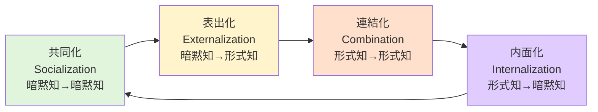

1. 共同化（共感知）：共有する、経験する
2. 表出化（概念知）：対話する、具体化する、言語化する
3. 連結化（体系知）：組み合わせる、体系化する
4. 内面化（操作知）：実践する、暗黙知を生み出す

### DIKWモデル
1. データ（Data）：ある出来事を数値・テキスト・音声・動画などで収集したもの
2. 情報（Information）：データに基準や意味を付け加えて分析したもの（いつ、どこで、誰が、何を）
3. 知識（Knowledge）：情報を体系化して使える形に整理したもの（どのように）
4. 知恵（Wisdom）：知識を統合した最良の意思決定をする理由となるもの（なぜ）

## 事業計画

### リーンキャンバス（ビジネスモデルの仮説検証）
1. 課題：ターゲットがかかえる上位3つの課題は何か、その原因は何か、一般的にどのように対策されているか
2. 顧客セグメント：誰に売るか（業界・業種・規模、価値観や動機、地域）、STP分析、顧客に対する不確実性やリスクはあるか
3. 独自の価値提案：どうなれば独自の価値を感じてもらえるか（最新・流行、利便性、カスタマイズ性、楽しい、コスト削減、売上向上、利益向上、新規顧客獲得、役割を果たす、設計、ブランド・ステータス、価格）、簡潔なメッセージ
4. ソリューション：課題解決に有効な上位3つの提案
5. チャネル：どのような接点があるか、どのアプローチにするか、アプローチに関する不確実性やリスクはあるか
6. 収益の流れ：顧客がよろこんで支払う価値は何か、現在は何に支払っているか、その価値は顧客のビジネス全体にどの程度貢献するか、どのように収益化するか（無料・有料、単発・継続、○○料）、いくらで売るか
7. コスト構造：必要なコスト・重要なコストは何か（人件費、宣伝費、開発費、固定費、変動費など）、コストが増大する要因はあるか、重要なリソースは何か、コスト重視・価値重視、規模や範囲でコストは変動するか
8. 主要指標：どの数値を向上させるのか（KPI）、AARRRモデル（獲得する、提供する、リピーターになる、紹介してもらう、収益化する）
9. 圧倒的な優位性：他社に真似されないこと、なぜ真似されないのか

### ビジネスモデルキャンバス（ビジネスモデルの改善）
1. キーパートナー：協業するパートナー・サプライヤー、パートナーからどんなリソースを獲得するか、協業する動機は何か（経済的、リスクと不確実性の低減、リソースとアクティビティの取得）
2. 顧客セグメント：誰にとって価値が高いか、もっとも重要な顧客は誰か（業界・業種、規模、価値観・動機、地域、マス・ニッチ）、STP分析、顧客に対する不確実性やリスクはあるか、
3. 独自の価値提案：どうなれば独自の価値を感じてもらえるか（最新・流行、利便性、カスタマイズ性、楽しい、コスト削減、売上向上、利益向上、新規顧客獲得、役割を果たす、設計、ブランド・ステータス、価格）、簡潔なメッセージ
4. キーアクティビティ：事業内容（制作、問題解決、プラットフォーム）
5. チャネル：どのようにリーチしてきたか、どのようにアプローチするか（意識を高める方法、評価を高める支援方法、購入してもらう方法、提供する手段、販売後のサポート）
6. 収益の流れ：顧客がよろこんで支払う価値は何か、現在は何に支払っているか、その価値は顧客のビジネス全体にどの程度貢献するか、どのように収益化するか（無料・有料、単発・継続、○○料）、いくらで売るか
7. コスト構造：必要なコスト・重要なコストは何か（人件費、宣伝費、開発費、固定費、変動費など）、コストが増大する要因はあるか、重要なリソースは何か、コスト重視・価値重視、規模や範囲でコストは変動するか
8. キーリソース：どの数値を向上させるのか、強みは何か（ヒト・モノ・カネ・情報）
9. 顧客との関係性：どのようにやりとりをするのか（個人・会社、直接・間接、単発・継続、コミュニティー、協創）

### AARRRモデル（アーモデル、サービスの成長段階）
- 獲得（Acquisition）：ユーザーを「どこから」「どのくらい」獲得しているか
- 活性化（Activation）：ユーザーが「どれくらい」好ましい体験をしているか
- 継続（Retention）：ユーザーは「継続して」サービスを利用してくれているか
- 紹介（Referral）：ユーザーは友人やまわりに、このサービスを伝えているか
- 収益（Revenue）：的確にマネタイズされているか

## ピープルマネジメント

### 責任
- 遂行責任（Responsibility）
   - 相談をしながら今できる最善を尽くす
   - うまくいなかったら別の方法を試す
   - 完了するまでやり遂げる
- 説明責任（Accountability）
   - 成功と失敗を明確に定義する
   - 失敗した原因を明確にして改善案を立案する
   - ステークホルダーが納得できるように説明する
- 賠償責任（Liability）
   - 自分の身（時間やお金）を削ってやり遂げる
   - 減給や降格といった処分を受け入れる
   - 辞職する

[責任をストレスに感じたら](https://zenn.dev/manabuyasuda/articles/3a1897edf2df16)

### 目標管理

#### PGST
1. 目的（Purpose）：実現したい事柄・到達しようとする状態（どうありたいのか）
2. 目標（Goal）：測定可能な指標・KPI・観測可能な事柄（どうなればいいのか）
3. 戦略（Strategy）：方向性、シナリオ、計画（何をするのか）
4. 戦術（Tactics）：具体的な手順・スケジュール（どのようにするのか）

#### OKR
1. 目標（Objective）：定量的または定性的な目標・状態（3〜5個）
2. 成果指標（Key Result）：目標を達成するための定量的な目標（目標ごとに3〜4個）

---

- ※目標設定の指標はSMART（具体的・測定可能・実現可能・関連性・期限）にもとづいていること
- ※「上位のKey Result」が「下位のObjective」になる（会社KR→チームO→チームKR→個人O）
- ※週次などの高頻度なレビュー
- ※60%〜70%を基準にした目標の達成度

[最短最速で目標を達成するＯＫＲマネジメント入門 - かんき出版](https://kanki-pub.co.jp/pub/book/9784761273996/)

### RACI
- 実行責任者（Responsible）：割り当てられたタスクの完了に責任を持ち、説明責任者に進捗を報告し、相談先や説明責任者に相談をする
- 説明責任者（Accountable）：タスクを正しく完了させることに責任を持ち、実行責任者の状況を把握し、報告先に進捗を報告し、場合によっては相談先にサポートを依頼する
- 相談先（Consulted）：タスクのサポートをする責任を持ち、実行責任者や説明責任者からの相談を受けたり、能動的に積極的なサポートをする
- 報告先（Informed）：タスクの状況報告を受ける人で、報告に問題がある場合は説明責任者に連絡をする

RACIは「担当者」と「WBSや成果物」ごとに役割を設定することが多いです。1人で実行責任者と説明責任者を兼務することもあります。
画像検索をするとサンプルがたくさん見つかるのでRACIで検索してみてください。

以前記事に書いた[チームで意思決定をするときのフレームワーク「DACI（デイシー）」](https://zenn.dev/manabuyasuda/articles/c8183c5e45d631)と似たツールですが、DACIが意思決定をするためのツールなのに対して、RACIは誰が何に対して責任を負っているのかを明確にするツールです。

意思決定が必要ということは適切な形が見えていないとも言えます。DACIでは推進者（Driver）という役割を持たせることで前に速く進めていくことができます。
RACIは作るものや求める結果が明確な場合に使いやすいと思います。
あるいは全体像はRACIで計画しながら、部分的に意思決定が必要な項目に対してはDACIで進めていくこともできそうです。

### DACI
1. 推進者（Driver）
2. 承認者（Approver）
3. 貢献者（Contributor）
4. 報告者（Informed）

### 調整の設計10
1. 人と人が働く、ルールとプロセスを決める：都度調整しない
2. 意思決定プロセスを決める：提案・稟議のプロセスを明確にする
3. 組織全体の目標の可視化する：意思決定基準を明確にする
4. 情報処理システムをつくる：意思決定に必要な情報を共有する
5. 直接コンタクトの活用をする：横のコミュニケーションをとる
6. 情報集約と調整の担当をたてる：情報を集約し、調整役をたてる
7. 臨時の問題解決チームをつくる：責任者はたてること
8. プロジェクトチームをつくる：定例的なチームをたてる
9. 部門をつくる：専門部署を新設する
10. マトリクス組織をつくる：全社を横断する組織を作る

### 分業の設計5
1. 目標の複雑さを下げる：実行可能な目標に分割する
2. 分業の度合いを低くする：複数の役割を持たせて調整コストを下げる
3. アウトプットの多様性を削減する：成果物の自由度を下げて選択肢を減らす
4. 資源の余剰をつくる：人的リソースを増やし柔軟性を上げる
5. 調整せず自己完結できる部門にする：部門ごとに権限を委譲し自立させる

### 職業ストレス（仕事の要求度コントロールモデル、カラセック・モデル）

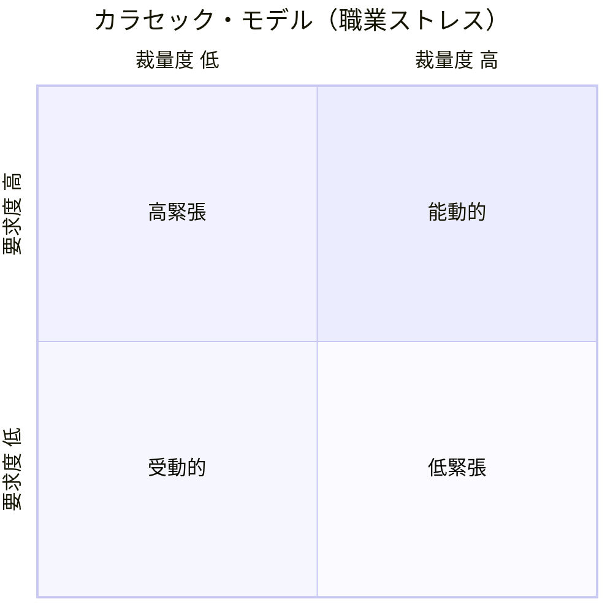

- 能動的
  - 要求度（高）×裁量度（高）
  - 大変だけど、達成感がありストレスを溜めにくい働き方
- 高緊張
  - 要求度（高）×裁量度（低）
  - ストレスが溜まりやすい働き方→まわりのサポートで緩和する
- 低緊張
  - 要求度（低）×裁量度（高）
  - ストレスが溜まりにくい働き方
- 受動的
  - 要求度（低）×裁量度（低）
  - 楽だけど、やる気が削がれる働き方

### 自己決定理論（モチベーション）
1. 関係性：他者から求められていて帰属感があり貢献したいと思える
2. 有能性：自分には十分な能力があると感じられる
3. 自律性：自らの意志で自分を律しながら主体的に行動できる

### Will×Skillのアサインマトリクス

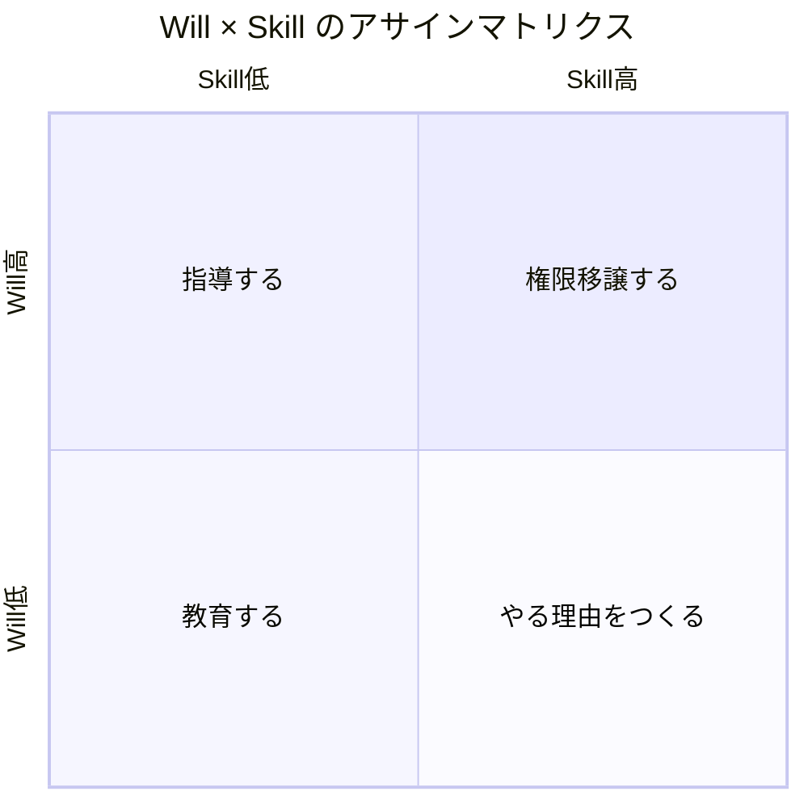

1. 権限移譲する（Will高×Skill高）
2. 指導する（Will高×Skill低）
3. やる理由をつくる（Will低×Skill高）
4. 教育する（Will低×Skill低）

### Will x Canのアサインマトリクス

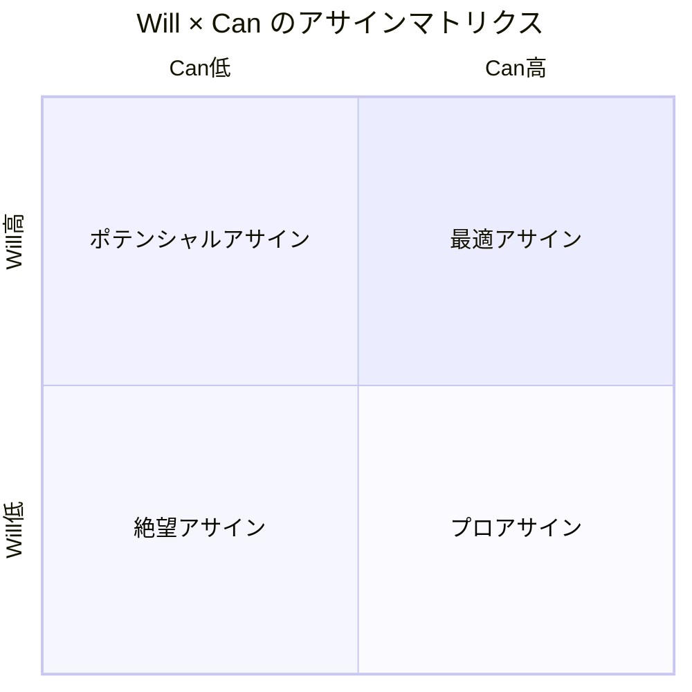

1. 最適アサイン（Will高×Can高）
   - やりがいと成果が最大化する理想のアサイン
2. ポテンシャルアサイン（Will高×Can低）
   - 条件付きのアサイン（要マネジメント）
   - 課題：足りていないこと（課題）を合意する、wantではなくmustで伝える
   - 援助：サポート・介入する範囲・状況を合意する
   - 時間：マネジメントするリソースがない場合はアサインできないことを伝える
   - 挑戦：小さな範囲で試して検討することも可能
3. プロアサイン（Will低×Can高）
   - できるけどやりたくない仕事
   - 必要：その仕事が必須であることを伝える
   - 信頼：あなただから安心して依頼できることを伝える
   - 改善：改善余地を説明し、やりがいをもってもらう
   - 成長：やりたい仕事をするための課題を提示し、支援する
4. 絶望アサイン（Will低×Can低）
   - やりたくないし実現可能性も低いアサイン
   - 続けると人が辞めるアサイン方法

[Skill Willマトリックス：アサインする側される側の期待値とプロセスの認識を合わせる](https://zenn.dev/manabuyasuda/articles/474bd6f657fc46)

### Willの4象限
前提として、わかった気にならずに、深く話を掘り下げていくことが大切。

1. キャリアアップ型Will
   - キャリアイメージを根拠にしたやりたいこと
   - 正確なキャリアプランは難しいことを前提に、意見やアドバイスをする
2. ポジション型Will
   - 自分が担うべき役割を根拠にしたやりたいこと
   - マネジメント層から見たその業務の意味付けや重要性を説明する
3. タイプ型Will
   - 自分の特性を根拠にしたやりたいこと
   - 自己認識を元に、客観的な意見も伝えて考えてもらう
4. ビジョン型Will
   - 自分の夢やビジョンから逆算したやりたいこと
   - 中長期的なビジョンは見えにくいことを前提に、意見やアドバイスをする

### 成功循環モデル
1. 関係の質（Quality of Relationships）
2. チーム思考の質（Quality of Collective Thinking）
3. 行動の質（Quality of Actions）
4. 結果の質（Quality of Results）

| レベル | 関係の質| 思考の質 | 行動の質 |
|---|---|---|---|
| 0️⃣ | あいさつ、声かけ つながり、会話量 | 関心の広がり、共同思考 | － |
| 1️⃣ | ありがとう、活気、尊重 | 受け止め、ポジティブ思考、行動意欲 | 笑顔、フレンドリー |
| 2️⃣ | 背景理解、率直さ、横断 | 未来感受、当事者意識、システム思考、内省、発想 | アジャイル、行動変容、支援 |
| 3️⃣ | 一体感、協働、信頼、越境 | 探求、確信、互恵、視座 | 新たな習慣、主体的行動、誠心誠意 |
| 4️⃣ | － | 意味創造 | ボランティア・チーム、洞察・配慮 |
| 5️⃣ | － | － | 自己組織化、共創行動 |

### ToMo指数
- 楽しさ（×10）：好奇心が発揮され、仕事自体を楽しめる状態
- 目的（×5）：仕事の結果に価値が感じられる状態
- 可能性（×1.66）：自分の将来にとって価値がある状態
- 感情的圧力（×-1.66）：失望されないように仕事をする状態
- 経済的圧力（×-5）：報酬を得るため、報酬を下げないために仕事をする心理状態
- 惰性（×-10）：とくに動機もなく、仕事を継続している状態

### PM理論（PerformanceとMaintenance）

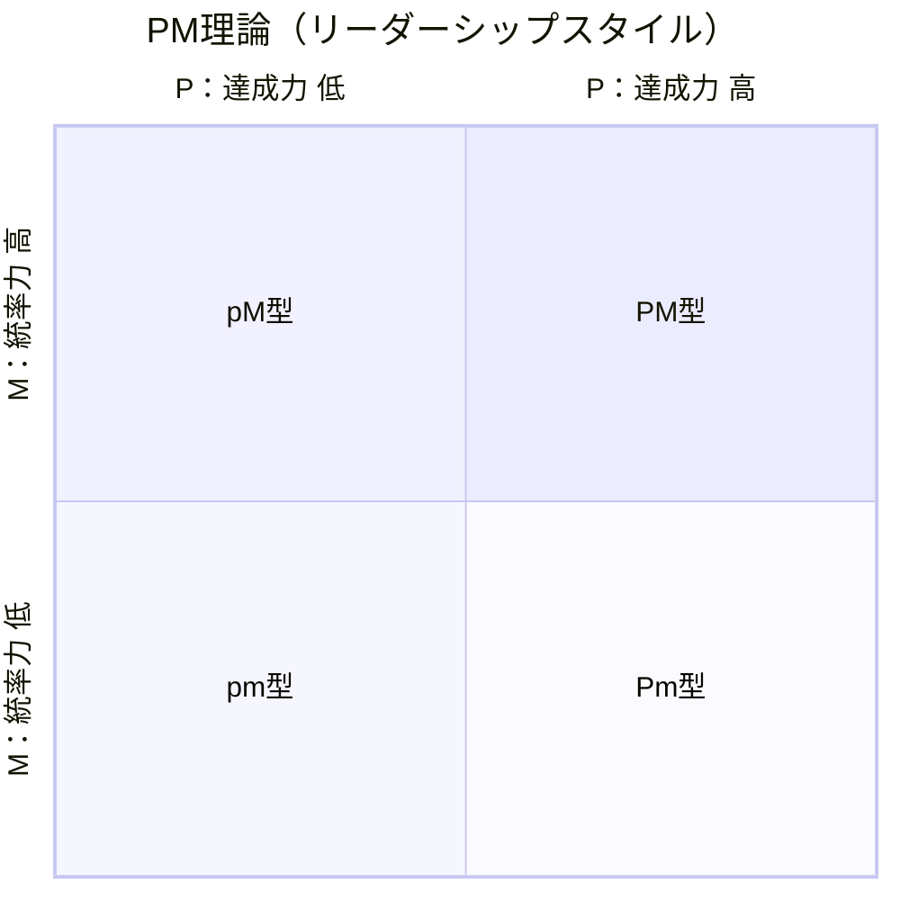

- PM型：目標達成も集団への配慮もできる
- Pm型：目標達成はできるが集団をまとめるのが苦手
- pM型：目標達成力は低いが集団をまとめる力がある
- pm型：目標達成も集団をまとめるのも苦手

### FFS理論（Five Factors & Stress理論）
- 凝縮性（こだわりの強さ）
  - 推進力⇄融通が利かない
  - 価値観の否定→独善的
  - 判断軸：自分の価値観上で正しいか・正しくないか
  - 毅然としている・頻繁に反応しない
- 受容性（受け入れる力）
  - 柔軟性・面倒見がいい⇄優柔不断・抱えこむ
  - ないがしろ→介入的→逃避的
  - 判断軸：相手にとって良いか・悪いか
  - うなずく・明るく振る舞う
- 弁別性（ハッキリさせる力）
  - 合理的・具体的⇄ドライすぎる
  - 割り切れない→機械的・自己都合的
  - 判断軸：適合しているか・していないか
  - 確認する、無駄なことをしない
- 拡散性（飛び出す力）：
  - 挑戦的⇄飽きっぽい・あまのじゃく
  - 制約される→衝動的
  - 判断軸：好きか・嫌いか
  - とりあえず、マイペース
- 保全性（積み上げる力）：
  - 計画的・安心感⇄慎重すぎる
  - コントロールできない状況→思考停止・拒絶的
  - 判断軸：好きか・嫌いか
  - 確実に、少しずつ信頼関係を築く

「[FFS理論について　FFS理論　ヒューマンロジック研究所](https://human-logic.jp/about/)

### フォッグ式消費者行動モデル
- 行動 = 動機 × 行動障壁 × トリガー
- 動機（Motivation）：行動を起こす理由（評価してほしい、ネガティブな結果を避けたい、興味がある、ありたい姿に近づける）
- 行動障壁（Ability）：行動ができなくなる原因（めんどくさい、割に合わない、好きじゃない）
- トリガー（Trigger）：行動を起こすキッカケ（習慣になっている、定期的な予定がある、なんらかのフィードバックがあった、成功した、失敗した、やると宣言した）

### うまく教えるための指標
1. 前提：教えるために必要な前提知識や情報を揃える
2. 範囲：どの範囲を話して、何をゴールとするのかを伝える
3. 構成：相手が理解しやすい順番で伝える
4. アレンジ：相手が知っていることで例える
5. 情報量：その時間で相手が理解しきれる情報量にする
6. スピード：相手の理解が追いつく速度で話す
7. 語彙：相手が知っている平易な言葉を使う
8. ケア：相手が話についていけているかを確認する

### 脳科学に基づく学習法14ヵ条
1. 「やり始める」から「やる気」になる：やる気は脳の側坐核を刺激することで生まれる、
2. 目標を強くイメージすれば行動が変わる：明確なイメージがあれば観念運動によって目標に向かって動き出すことができる
3. 「望ましい困難」が学力を高める：
4. スモールステップ法で達成体験を積み重ねる
5. まずは得意な科目を伸ばす
6. 失敗は成功のもと
7. 就寝前は記憶のゴールデンアワー
8. 記憶力は食事前に高まる
9. 五感を使って暗記する
10. 脳は入力よりも出力を最重視する
11. 繰り返しの復習が記憶を定着させる
12. コツコツ学習は一夜漬けに勝る
13. いろいろな単元を混ぜて学習する
14. 様々なバリエーションで学習する

https://www.kyoshin.co.jp/manage/wp-content/uploads/junior-school-house/304228/5e6cc73775b18.pdf

### めんどくさい攻略法
1. 手順が曖昧：やり方を思い出すのが億劫
   - ×やり方を思い出そうとする→非効率に感じる→もっと気が進まなくなる
   - ○非効率でも手を動かす→できるようになってくる→夢中になっている
2. 手順が不明：やり方がまるで分からない
   - ×頭の中で考える→考えがまとまらない→動けない
   - ○すべて書き出してみる→考えが整理できてくる→最初にやることが分かる
3. 考えることすらストレス：どうしてもやりたくない
   - ×考えないようにする→どうしても思い出してしまう→もっと嫌になる
   - ○最初のタスクだけを思い浮かべる→次にやることが浮かんでくる→行動のスイッチが入る
   - ○気持ちは切り替えない→迷ったままとりあえず身体を動かす→思考が迷いから離れていく
   - ○無の状態で動作を確認するようにこなす→準備が終わる→行動しないほうがおかしい状態になる
  
[「めんどくさい」攻略法｜F太](https://note.com/fta7/n/naaa1052f3581)

### 行動を促すための6つの自問
1. どんな見返りがあると、また行動したくなりますか？
2. 逆にどんな見返りだと、行動したくなくなりますか？
3. 良い見返りはどんな行動や状況から生まれやすいですか？
4. 悪い見返りはどんな行動や状況から生まれやすいですか？
5. 具体的に、どんな状況でどんな行動をとるとよさそうですか？
6. 具体的に、どんなきっかけやイメージがあれば行動しやすいですか？

### きっかけを促す「プロンプト」
1. ちょっとしたリマインド
2. 問いかけ（次はどうする？）
3. ステップごとの指示（次は〜して）
4. マニュアル・図解
5. 手本を見せる
6. 一緒にやる

---

- ※弱いプロンプトは、失敗しやすいが手間がかからず依存しにくい  
- ※強いプロンプトは、失敗しにくいが手間がかかり依存しやすい

### 生産性
成果×資産×充実

- 成果：売上、利益、顧客獲得、実績獲得
- 資産：専門スキル、ビジネススキル、経験、価値観の更新
- 充実：自分自身の満足度、他者貢献から得られる幸福感

[仕事での生産性の本質を、哲学的に掘り下げ考えてみる｜読むとマーケティングがおもしろくなるブログ](https://www.countand1.com/2020/04/work-productivity-essence-with-philosophy-thinking.html)

### 革新的な文化に関する厳然たる真実
- 不確実性に対する失敗には寛容だが、無能と平凡を許容せず、高いパフォーマンスと貴重な教訓を要求する（課題：失敗の原因は常に明確ではなく、評価をくだす明確なタイミングはない）
- 市場における実験を好むが、考えなしの行動を許容せず、明確な基準と規律的なプロセスを要求する
- 心理的に安全だが、対立を避けず、痛いほど率直に建設的な批判を要求する
- お互いによく支援するが、責任の分散を許容せず、個人の責任による決断を要求する
- フラットで迅速な関係性を好むが、待ちの姿勢を許容せず、強力なリーダーシップと明確な戦略を要求する

---

- 混乱：判断の微妙なニュアンスまで明確でないと、人々は簡単に混乱する
- 反発：部分的に受け入れがたい行動に対して歓迎されなかったり、うまくいかなかったりする
- 相互依存的なシステムなので、行動がどのように補完や強化するのかを考える必要がある
- 自由には責任が伴うことを身をもって理解してもらう必要がある
- 小さなチームに切り出しても、文化は簡単に変わらず、親ユニットの文化を継承する傾向にある
- 革新的な文化は不安定になる可能性があるので、兆候に警戒して、必要に応じて介入する必要がある

[Innovation Isn’t All Fun and Games — Creativity Needs Discipline](https://hbr.org/2019/01/the-hard-truth-about-innovative-cultures)

### 学習の4ステップ
1. 概念の理解：知識がある、一部は実行できる
2. 具体の理解：経験がある、限定的に一人で回せる
3. 体系の理解：能力がある、複雑なケースでも対応できる、一部は教育できる
4. 本質の理解：見識がある、問題を認知し効果的な解決策を提示できる、臨機応変に対応・教育できる

### 「管理」の明確化（Management・Control、Administration）
1. Administration：組織にとって重要な方針や目標を設定すること
2. Management：目的を達成するために、予測・計画・意思決定すること
3. Control：マネジメントを達成するために制御・統率すること

### 権限委譲（自走）型の依頼フォーマット
1. 目的（Why）
   - この業務の目的は○○です。最終的には□□の状態を目指します。
2. ゴール・成果物（What）
   - 完成形のイメージや例
   - 成果物の形式（例：ドキュメント、デザイン、コード）
   - 成果物が満たすべき条件
3. 範囲（Scope）
   - 任せること任せないこと（判断や対応しない範囲）
4. 期限（When）
   - 中間報告日：○月○日
   - 最終納期：○月○日
5. 権限（Authority）
   - この範囲での判断・意思決定は本人に任せる
   - この範囲は相談必須
6. コミュニケーション（How often / How）
   - 報告頻度：週1回ミーティング＋必要時チャット
   - 相談方法：Slack・Zoomなど
7. サポート体制（Support）
   - 相談窓口：△△さん
   - 利用可能なリソース：○○資料、□□ツール
8. 評価基準（Acceptance Criteria）
   - 品質基準（例：バグ0件、顧客満足度80%以上）
   - 納期遵守
   - 依頼目的との一致度

#### 権限移譲のアンチパターン
- 依頼時
  - やり方もゴールも丸投げ
      - 「とりあえずやってみて」と言われても、わからないことが多すぎる。
   - 目的・背景の説明なし
      - そもそも何のためにやるのかがわからない。
   - 優先順位がつけられない
      - 「なるべく早めにやって」と言われても、具体的にいつならいいか判断できない。
      - 「空いた時間にやって」と言われても、空いた時間はない。
   - 時間配分の目安なし
      - どれくらいのリソースを使って良いのか不明。
- 実行中
   - 進捗の把握をしない
      - 報告・連絡・相談がなければコミュニケーションを取らない。
   - 咀嚼しきれない量のアドバイス
      - 報告・連絡・相談時に大量のアドバイスや指摘をする。
   - 「上司の考える正解」を当てさせるゲーム化
      - 答えが決まっているのに事前共有せず推測させる。
   - 判断材料を渡さない
      - 必要な情報や権限がなく、手詰まりになる。
- 完了後
   - 依頼時に伝えなかった条件を後から指摘
      - 「実はこれも必要だった」と追加要件を出す。
   - 成果物だけを否定して終わる
      - 改善のヒントや次のステップがない。
   - 振り返りをしない
      - 成功・失敗の要因が共有されず、学びが残らない。

### 人が諦めてしまう理由
- 速い結果を期待する：「結果は時間をかけて築かれるものであり、焦らずに取り組みましょう。」
- 自分を信じられなくなる：「自分自身の能力を信じ、自己肯定感を高める努力が必要です。」
- 過去にとらわれる：「過去から学び、未来に目を向ける勇気を持ちましょう。」
- 失敗にこだわる：「失敗は成長のための貴重な経験であり、前に進むためのステップです。」
- 未来への不安がある：「未来への不安を乗り越え、前向きな計画を立てることが重要です。」
- 変化への抵抗がある：「変化を受け入れ、柔軟に対応する能力を育てましょう。」
- 権力を放棄する：「権力を適切に行使し、責任を果たす意識を持つことが求められます。」
- 自分の弱さを信じる：「弱さを克服し、自己成長を目指す姿勢が大切です。」
- 世界が彼らに何かを負っていると感じる：「自分の努力で成功を掴む強い意志が必要です。」
- 成功を望むよりも失敗を恐れる：「成功への渇望を高め、失敗への恐れを克服しましょう。」
- 可能なことをイメージしない：「可能性を広げ、夢を具体的にイメージする力を養いましょう。」
- 失うものがあると感じている：「リスクを受け入れ、チャンスを掴む勇気を持つことが大切です。」
- 働きすぎる：「効率的な働き方を身につけ、自分自身の健康を大切にしましょう。」
- 自分の問題を特別なものだと思い込む：「問題は共通しているものであり、解決策を見つける努力が必要です。」
- 失敗は後戻りするためのシグナルだと考える：「失敗は前進するための指標であり、挫折せずに取り組みましょう。」
- 自分自身を哀れに思う：「自己憐憫を乗り越え、自分の力で立ち上がる強さを持つことが重要です。」

AnnaVitals & AdiomaApp

### 休みの3R
1. Rest（エネルギー↑）：🛌物理的に身体を休める→エネルギーを回復する
2. Refresh（エネルギー↓、気持ち↑）：🏃‍♂️あえて別のことをする→違うところで気持ちを上げる
3. Relax（エネルギー↓、緊張↓）：🧘‍♀️あえて何もしない→気持ちがフラットになる

[「休み」はエネルギーコントロールという観点から3分類できる。「おうち入院」のすすめ。｜柴田史郎](https://note.com/4bata/n/ne923b17999cf)

### 休養の分類
1. 休息・休憩（秒・分）：活動時間内に生じた心身の疲労を回復
2. 私的時間（時）：運動・栄養・睡眠・趣味などで翌日の活動力を再生
3. 週休（日）：週間中の疲労負債の回復、人生設計に必要な素養の備蓄、対人関係の修復など
4. 休暇（週・月）：人生設計の準備、心身の調整など

### 7つの休養
1. 身体的な休養：受動的（十分な睡眠、効果的な昼寝）、能動的（ヨガ、ストレッチ、マッサージ）
2. メンタル面の休養：仕事中に定期的な休みをとる、心配事を書き出す、行き詰まったら仕事場から離れる
3. 感覚面の休養：デバイスの使用時間を減らす、通知をなくす（減らす）、音を遮断する、1分ほど目を閉じる、1日の最後はデバイスをオフにする
4. 感情面の休養：気持ちが落ちるニュースを避ける、気持ちが上がるものを見る
5. 社会的な休養：ポジティブな気持ちにしてくれる人と接する、他人の影響を受けない時間を過ごす
6. 想像面の休養：何もしない時間を過ごす、何かを作る、自然を感じる
7. スピリチュアル面での休養：瞑想やお祈りをする、エネルギーが得られる場所で過ごす、コミュニティに関与する

[誰にでも必要な「7つの休養」とは？ | ライフハッカー・ジャパン](https://www.lifehacker.jp/2021/01/228226the-7-types-of-rest.html)

### JYPの価値観
1. 真実：隠すものがない・気をつける必要もない立派な人になること。
2. 誠実：目標に向けて、するべきことを毎日続けること。弱い自分に負けないこと。
3. 謙虚：自分や相手の短所を責めるのではなく、相手の長所だけを見ること。ひとりでは成功できないことを理解して、心から感謝すること。

### 内的外的な論理と感情（モチベーション）
- 外発的論理
  - 状況：期待値が明確で、与えられた目標を達成できている
  - 結果：他者からの評価や報酬を十分に得られている、リスクを適切に回避したり最小限に抑えられている
- 外発的感情
  - 状況： 他者からの認知や肯定的なフィードバックを受け取っている
  - 結果：社会的な繋がりや所属感を十分に得られている、社会的な地位や名誉を損なっていない
- 内発的論理
  - 状態：自分の価値観や信念に従って行動できている
  - 認知：自分ならなんとかなりそうだと感じられる、社会的な規範や期待と一致している
- 内発的感情
  - 状態：好奇心や情熱が内面から自然に湧き起こっている
  - 認知：満足感や幸福感を感じている、新たなスキルを習得し、自己成長を実感できている

[モチベーションの原因を「論理と感情」「外発的と内発的」の組み合わせで理解する](https://zenn.dev/manabuyasuda/articles/c569197bd7da24)

### フルリモートで必要な能力
フルリモートで必要になる能力、それらを見極める行動と指標。

1. 自己管理能力（Self-Discipline & Well-being）
   - 定義：自身の行動と心身の状態をコントロールできる
   - 行動例
     - 自分で計画を立てて実行している
     - 集中できる環境や習慣を整えている
     - 心身の不調に早く気付き、適切に対処している
   - 評価方法
     - パフォーマンスの波が小さい
     - 計画を説明できたり、整理・可視化されている
2. 業務管理能力（Task & Time Management）
   - 定義：タスクを整理・計画し、期限内に成果を出せる
   - 行動例
     - 優先順位をつけて、やらないことを決めている
     - 逆算してスケジュールを立てている
     - 1人で課題を完了していて、必要に応じて相談している
   - 評価方法
     - 見積もり精度が高く、タスクの遅延や手戻りが少ない
     - 成果物の品質が高く安定している
     - 相談するタイミングが早く、相談内容が整理されている
3. 情報伝達能力（Communication）
   - 定義：必要な情報を、適切なタイミングと方法で相手に伝えられる
   - 行動例
     - 自分から進捗報告をしている（毎日 or 適切な頻度・タイミング）
     - 結論・要望・ネクストアクションを明確にして書いている
     - 自己解決の難しい問題を早期に報告している
   - 評価方法
     - 報告を待つことなく受け取れる
     - 状況や要望が理解しやすく、情報は記録・整理されている
     - 問題は事前に対策されていたり、問題が起きても素早く対応されている
4. 関係構築能力（Relationship & Collaboration）
   - 定義：信頼関係を築き、協働できる
   - 行動例
     - 日常的に自分からコミュニケーションを取っている
     - 相手の状況を理解するための質問をしている
     - わからないことを正直に伝えて相談している
   - 評価方法
     - チャットやMTGで一定以上の発言をしている
     - 困りごとがすぐに報告されていて、チームで問題を解決している

### 評価基準

#### グレード
1. 当たり前：求める最低基準のカバー率ひとりで任せられる人
2. 線形：できることの面積（幅×深さ）どんなことでも役に立てる人
3. 魅力的：離職による経営への深刻度いなくなると困る人
ほとんどの人は線形で評価される。

#### 行動分析
1. アウトプットの質（こだわり）
2. アウトプットの量（経験、行動量）
3. インプットの質（要領のよさ）
4. インプットの量（行動量）

#### 思考分析
1. ポジティブとネガティブのバランス（ネガティブな計画、ポジティブな行動）
2. 問題認識能力（事実と意見）
3. 論理的（結論→根拠）
4. 主体性（指示待ちしない）
5. 効率性（計画的）
6. 謙虚さ（向上心、受容）
7. チームワーク（俯瞰的、協力的、誰かのため：自分のため）

## ライティング
- 一文一意：1つの文章に1つの内容。
- 40〜60文字以内：1つの分は40〜60文字以内に収める。
- 具体的な表現：訴求は解釈の幅が狭い表現（数字など）や別の手段（写真など五感）を使う。五感に関する表現は抽象的になりやすい。具体的になるほどイメージが膨らむ。
- 結論から伝える：重要なことは最初に伝える。
- 最小限の前提情報：比較検討に前提情報は冗長。最小限に抑える。見出しで抽象、本文で具体にするとよい。
- 体言止め：接続詞が減る。文末の重複が避けられる。リズムが生まれる。
- 主語を省略：自明なら主語を省略する。
- 繰り返し禁止：幼稚な印象になる。読点「、」、指示語「その」「この」、こそあど「これ」「それ」「あれ」「どれ」、主語「この商品は〜。この商品は〜。」→一文一意、体言止め、主語を省略
- 重言禁止：「不快感を感じる」→「不快感がある」。「頭痛が痛い」→「頭痛がする」
- 修飾語禁止：「洗練された」のような修飾語は解釈にズレが生まれやすい。→具体的な表現
- カタカナ語禁止：理解や解釈にズレが生まれやすい。→具体的な表現
- まわりくどい敬語禁止：保険をかけて冗長な表現にしない。→結論から伝える
- 丁寧すぎる敬語禁止：慇懃無礼
- 話し言葉禁止：冗長になりやすい。→重要な言葉だけを残す

### 話の膨らませ方
1. その理由や根拠
2. 社会的・技術的背景
3. 歴史
4. 関係する理論
5. 反対意見への反論
6. 自分の経験
7. 応用例

### PREP法で簡潔に伝える
1. 結論（Point）：「結論」を伝える
2. 理由（Reason）：「理由」を簡潔に説明する
3. 具体例（Example）：「具体例」をあげる
4. 結論（Point）：「結論」でまとめる

### ホールパート法で全体像と話の順序を示す
1. 全体像（Whole）：全体像と数を示す
2. 詳細（Part）：1つずつ説明する
3. 全体像（Whole）：全体のまとめ

### 起承転結で順序立てて説明する
1. 起：モノゴトの背景や事前情報を伝える
2. 承：導入部分を伝える
3. 転：変化を伝える
4. 結：何が起こったのか、結論を伝える

### SDS法で印象づける
1. 概要（Summary）：概要を伝える
2. 詳細（Details）：詳細を説明する
3. まとめ（Summary）：まとめる

### DESC法で受け入れてもらう
1. 描写（Describe）：自分が対応しようとしている状況や相手の行動を、客観的かつ具体的な情報で説明する
2. 表現（Express）：自分が感じたり考えたことや相手への共感を、主語を「わたしは」にして伝える
3. 提案（Specify）：具体的で相手が対応しやすい粒度で解決策を提示する
4. 結果（Choose）：相手が同意したときとしなかった場合それぞれに対して、わたしがどうしたいかを伝える

### SPIN話法でニーズを引き出す
1. 状況（Situation）：「どのように」「どれくらい」で相手の現状を把握する
2. 問題（Problem）：「大変ですか？」「難しいですか？」相手の抱える問題（潜在的ニーズ）を洗い出す
3. 示唆（Implications）：「こうなっていませんか？」「こうなってしまいませんか？」で問題の重要性を伝える
4. 解決（Need-payoff）：「解決できたら何ができるようになりますか？」「こんなことができそうですね」で問題を解決するメリットをイメージしてもらう

### SOAP：POS（Problem Oriented System）を利用した記録形式
- 主観的情報（Subjective）：本人が感じたり考えたこと、まわりの人からの情報、今までの結果・出来事
- 客観的情報（Objective）：問題に対する計測できるデータ
- アセスメント（Assessment）：主観と客観を踏まえた問題分析、情報が足りない場合は主観・客観を見直す
- 計画（Plan）：アセスメントを踏まえた今後の計画立案

PCDA的にする場合の追加項目

- 介入（Intervention）：実施した具体的な内容を記録する
- 評価（Evaluation）：実施結果を評価する
- 修正（Revision）：結果を考慮して計画を修正する

[看護記録の構成・SOAP / DARの書き方、法に基づく保存期間 | ナースのヒント](https://j-depo.com/news/nursing-record.html)

### DAR：出来事に焦点を当てた記録形式
- フォーカス（Focus）：問題とそれに対する行動・目標などの収集
- データ（Data）：主観的・客観的な情報
- アクション（Action）：計画と実施記録
- レスポンス（Response）：実施に対する結果や反応

## 認知プロセス

### 使いにくさ
- 物理的側面：ボタンが押しにくい、文字が小さいなど
- 認知的側面：メニューが見当たらない、アイコンの意味がわからない

### 行為の7段階モデル
ゴールの形成が「本を読むために部屋を明るくしたい」の場合

1. 行為の計画：部屋の照明があるから、明かりを点けよう
2. 行為の詳細化：照明のスイッチを探して、手を当て、押して、ONにすればいい
3. 行為の実行：スイッチを押す（照明が点くはず）
4. 外界の状況の知覚：スイッチをカチッと押し込めてONにできた
5. 外界の状況の解釈：明かりが正常についた
6. 結果の比較：十分な明るさになり、本が読めるようになった

#### 行為の7段階モデルの重要なプロセス
- ゴールの形成：利用者が本当に求めているゴールは何か？
- 行為の詳細化：「行為」とその「結果」が想像できるか？
- 結果の比較：システムの反応（フィードバック）を知覚・解釈・評価できるか？

#### 結果の比較：5 State UI
1. Blank State：空っぽの状態
2. Loading State：待機中の状態
3. Partial State：部分達成状態
4. Error State：エラー状態
5. Ideal State：理想状態

### SRK( Skill / Rule / Knowledge )モデル
どのモデルにフォーカスするかで、プロダクトの作りが変わってくる。

- 知識（Knowledge）：初心者などが既存知識をもとに、その都度判断している
- 規則（Rule）：規則や手順を知っていて、パターン処理によって行動している
- 技能（Skill）：上級者などが経験をもとに直観的に行動している

### モデルヒューマンプロセッサ
- 知覚プロセッサ：100ms
- 認知プロセッサ：70ms
- 運動プロセッサ：70ms

## ユーザビリティとアクセシビリティ

### ユーザビリティ
- ある製品やサービス：「何を」使うか
- 指定された利用者：「誰が」が使うか
- 指定された利用の状況下：「どんなとき」
- 指定された目的を達成する際の：「何が」できるか
- 有効さ：目的を「達成できる」度合い
- 効率：目的の「達成しやすさ」
- 満足度：達成によって「満たされる」「不平不満がない」度合い

### アクセシビリティ
ユーザビリティの「利用者」「状況」「目的」を、より多く担保している状態。

## その他

### PDCA

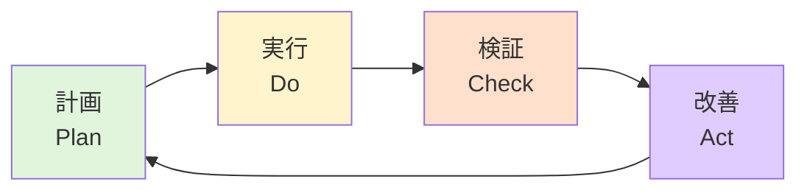

1. 計画（Plan）：情報を集める、仮説を立てる、検証可能な実行計画を立てる
2. 実行（Do）：実行計画にもとづいて実行する
3. 検証（Check）：仮説を検証する
4. 改善（Act）：仮説結果を情報に変換する

### OODAループ

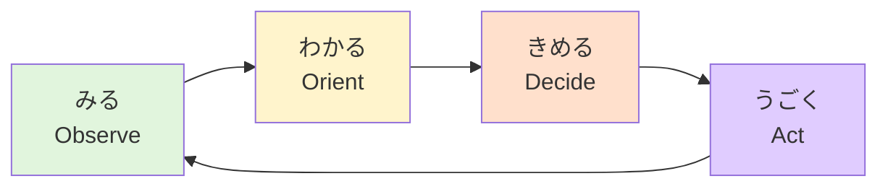

1. みる（Observe）：客観的な事実を受容する
2. わかる（Orient）：事象を主観的に理解する
3. きめる（Decide）：どんな行動をとるのか・取らないのかを決める、過去の経験からの直観、またはパターン化による仮説を当てはめる
4. うごく（Act）：成果が出るようにやり遂げる

### VUCA（既知・未知×予測可能・予測不能）

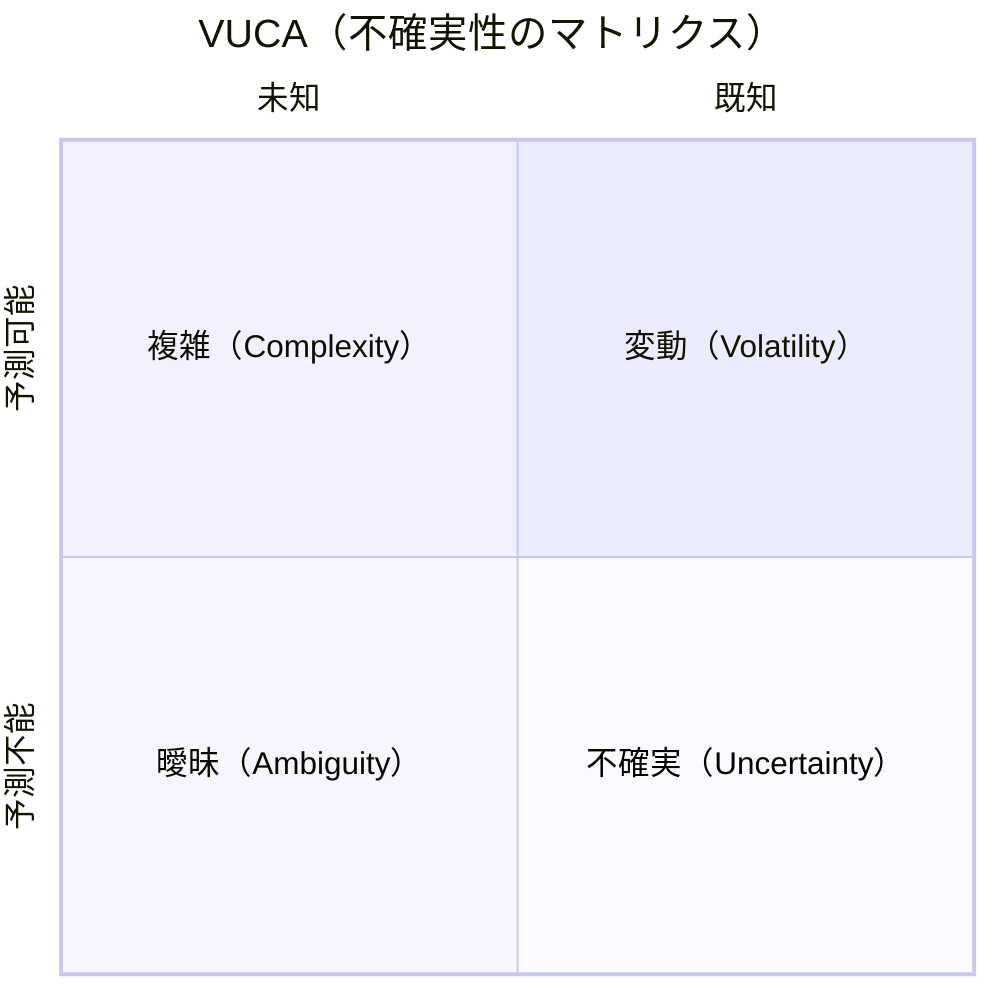

1. 変動（既知×予測可能）：即断即決（わかる→うごく）
2. 複雑（未知×予測可能）：わかる範囲を広げる（みる→わかる→みる）
3. 不確実（既知×予測不能）：結果を出して推論する（わかる→きめる→うごく）
4. 曖昧（未知×予測不能）：事実の収集→理解→決定→実行のループを実行する（みる→わかる→きめる→うごく）

### クネビンフレームワーク（Cynefin Framework）
1. 単純（Simple）：誰でも対応できる
   - 構造：明確
   - 方法：最良の方法がある
   - 行動：気づく（Sense）→分類する（Categorize）→対応する（Respond）
2. 煩雑（Complicated）：分析すれば対応できる
   - 構造：やや複雑
   - 方法：専門家の分析で優れた方法を提示できる
   - 行動：気づく（Sense）→分析する（Analyze）→対応する（Respond）
3. 複雑（Complex）：やってみないと分からない
   - 構造：かなり複雑
   - 方法：専門家の調査・探索→Complicatedに変換
   - 行動：調査する（Probe）→気づく（Sense）→対応する（Respond）
4. カオス（Chaotic）：緊急事態から脱出する
   - 構造：理解が難しい、正解が変わり続ける
   - 方法：やれることをすぐに実行→Complexに変換
   - 行動：行動する（Act）→気づく（Sense）→対応する（Respond）

### 「So What？」「Why So？」
- 「So What？」
  - 主張（意味付け、価値、影響）を引き出す
  - 「具体的には？」「どんな（いいこと、悪いこと）が起きる？」「何を決められるといい？」
- 「Why So？」
  - 根拠（理由、因果関係、前提条件）を引き出す
  - 「なぜそれが起こるんだろう？」「何を前提にしているんだろう？」「どれくらい信頼できるんだろう？」「別の可能性は？」

### 具体⇄抽象
- 具体化：ある事象を分解して明瞭（はっきりと見分けられる状態）にすること
- 抽象化：ある事象を一般化・単純化・構造化などの軸で表現すること
- 「たとえば」→具体化
- 「他には」→具体例を集める
- 「つまり」→具体例を整理する
- 「だとすると」→一致と不一致を確認する

### 詳細⇄簡略
- 詳細化：ある事象を細部まで掘り下げて明確（はっきりと間違いがない状態）にすること
- 簡略化：複雑なものを単純な状態にすること

### 一般⇄特殊
- 一般化：ある事象を包括的な単語で表現すること（猫➝哺乳類➝動物➝生物）
- 特殊化：包括的なものを特定の条件に対して適用すること（生物→動物➝哺乳類➝猫➝）

### 単純⇄複雑
- 単純化：共通した事実を抜き出したり、不必要なものを取り除いて、簡潔に表現すること
- 複雑化：事象同士が相互連結・依存などで絡み合い、ややこしくなること

単純なものは単純に、複雑なものは複雑に扱う。  
単純なものを複雑に、複雑なものを単純に扱うと、分岐で複雑になってしまう。

### スキルとセンス
- スキル：課題を解決する能力、直接的、定量的、部分的、代替可能（マニュアル化）、一時的価値、課題を通して磨く
- センス：問題を認識して課題に変換する能力、間接的、定性的、全体的、代替不可能、普遍的価値、スキルを通して磨く

### 2つの価値
- 一時的価値：何かしらの作業で身につく、具体的だが応用不可能、陳腐化するしAIが代替可能（ツールの使い方、技術的な知識など）
- 普遍的価値：一時的価値を通して身につく、抽象的だが応用可能、陳腐化せずAIの代替不可能（ロジカルシンキング、ラテラルシンキング、言語化能力、ファシリテーション能力、リーダーシップ、チームビルディングなど）

[ベイジで働く意義 - Speaker Deck](https://speakerdeck.com/sogitani1107/beizidedong-kuyi-yi)

### 仕事×給与×評価
- 昇給（ボーナス）  = 営業利益向上
- 自己への働きかけ→スキルアップ
- 社内への働きかけ→リーダーシップ・チームワーク
- 社外への働きかけ→広報・情報発信
- スペシャリスト：自己 > 社外 > 社内
- スペシャリスト→ゼネラリスト：自己 > 社外 > 社内→社内 > 社外 > 自己
- ゼネラリスト：社内 > 社外 > 自己
- 評価基準：成果を出す→評価される、継続的に行動する→先行投資として評価される、行動する・学習する・意識する→評価されない
- 評価：他者が、他者の価値基準に沿って、評価基準の定量化は困難、
- 評価方法：最低限の目線、複数の評価者、主観重視

[仕事と給与と評価の関係 - Speaker Deck](https://speakerdeck.com/sogitani1107/shi-shi-togei-yu-toping-jia-falseguan-xi)

### リーダーとは
リーダーとは、誰よりも成果を生み出す人。

- 自分の意見を誰よりも早く出す
- 人自ら変化を起こす人
- 最も成果に繋がることにリソースを集中する人
- 目的と目標を指し示す人
- 不確実性が高くても決める人
- 困難でもやり遂げる人

危機的な状況で「この人に付いていきたい」と思わせる人がリーダーシップのある人といえる。

### 体験と経験
- 体験：ある行動をしたこと、行動によって起きたこと・感じたこと
- 経験：行動によって身につけた知識や技能のこと

### 自己肯定感
- 自尊感情：他人からの承認や評価に依存しなくても自分自身に価値を感じられる
- 自己受容感：自分自身を非難することなく長所も短所も受け入れられる
- 自己効力感：挑戦や困難な状況でも効果的に対処できる
- 自己有用感：誰かや社会に対して貢献できる
- 自己信頼感：困難な問題に直面しても自分自身を信じられる
- 自己決定感：人生の重要な決定を自分でコントロールできる

### パフォーマンスを構成する要素
- IQ：知能・情報収集力・ロジカルシンキング
- EQ：自分と他人の気持ちを理解して適切な行動に変換できる能力
- ナレッジ：業務に必要な知識や知見
- アクション：行動量

### スイッチングコストが高い状況
- 頻繁に切り替えが必要
- 短時間で切り替えが必要
- コミュニケーションの単位が小さい
- 集中が必要な作業がある
- ツールの切り替えがある
- ミーティングなどの動かせない時間帯が多い
- 要求度が高い

### 主張を抜き出す
- 「だが」「しかし」などの逆接の接続詞の直後が主張、その前は無視する
- 「ではない」の直後が主張
- 「ではないだろうか」は強調（疑問ではない）
- 「たとえば」に主張はない（主張の補足）

### 悩むと考える
- 悩むのは決断できないから
- 決断できないのは情報が足りていないから
- 変化のデメリット ＝ 不安定性 × 不確実性
- わかる範囲を広げることができるへの道
- 行動からわかる範囲は広がる
